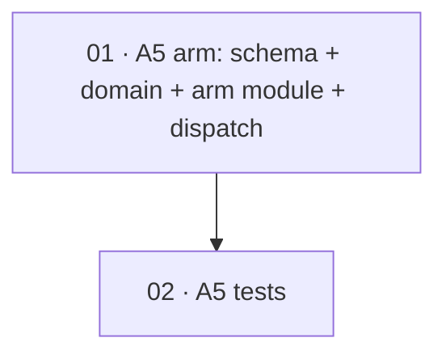

# Plan: Add a lighter pre-canned ablation arm (A5)

**Status:** Proposed · **Layout:** kanban · **Date:** 2026-05-28 · **Owner:** Ant Stanley · **Source spec:** [changes/2026-05-28-add_lighter_precanned_arm.md](../../benchmark/specs/changes/merged/2026-05-28-add_lighter_precanned_arm.md)

Build the **A5 — Lighter pre-canned** arm the change spec proposes: a sixth ablation arm that emits the observable artifacts of a gated workflow run (a candidate code patch + at least one discharged done-certificate carrying a real `VERDICT:` line so `extract_gate_events` sees ≥ 1 `GateEvent`) WITHOUT a recursive `spec-planner` + `spec-builder` build. A5 runs ONE fixed, non-recursive `claude -p` call on a small budget cap (`A5_MAX_BUDGET_USD = 5.0`) and a short timeout (`A5_RUN_TIMEOUT_SECONDS = 600`). The decomposition is two tasks ordered for reviewability: **01** opens the `ArmSlug` enum (schema + domain), adds the `benchmark/harness/arms/a5.py` arm record + pre-canned recipe, exports it, and routes the A5 slug to a dedicated pre-canned `_run_a5` path in the container backend; **02** adds the test surface — the A5 record validates + round-trips, `ARM_SLUGS`/`ArmSlug` include A5, the config + constants are correct, A5 dispatches to `_run_a5` (not A0/workflow/A4), the pre-canned prompt carries the certificate+VERDICT directive, and a captured A5-style certificate yields a `GateEvent`. The live container path is gated/by-reading (no Docker here); the build verifies the unit + skip surface.

---

## Source and definition-of-done baseline

- **Spec.** [changes/2026-05-28-add_lighter_precanned_arm.md](../../benchmark/specs/changes/merged/2026-05-28-add_lighter_precanned_arm.md) — the whole change spec is in scope. Its `Proposed changes` target [01-domain-model.md](../../benchmark/specs/01-domain-model.md) (§Arm slug `A0`–`A5`) and [02-arms.md](../../benchmark/specs/02-arms.md) (new §A5 subsection + the reconciled *Six arms* Decision); the canonical prose is applied at *merge* (after this plan is built, by the orchestrator, alongside a parallel `02-arms.md` edit), so each task's `Implements` points at the change spec's sections, not yet-merged canonical headings. The SCHEMA sidecar (`canonical-types.schema.json`) IS edited in this build — it is the runtime validation authority `domain.py` loads, and `Arm(slug="A5")` cannot validate without it.
- **Already built (preconditions, not tasks).** `ContainerRunBackend` with its slug-based dispatch (`benchmark/harness/backends/container.py` — `run:363`, `_selects_agent:821`, `_selects_workflow:826`, `_selects_a4:841`, `_run_a0:398`, `_run_a4:429`, `_extract_patch:1086` with `exclude_artifacts`, `_capture_artifacts:1169`, `last_gate_events:774`); `extract_gate_events` (`benchmark/harness/arms/a2_a3.py:370`); the A0 arm + recipe (`benchmark/harness/arms/a0.py`); the arms package `__init__.py`; the domain `Arm` record + `ARM_SLUGS` (`benchmark/harness/domain.py`); the canonical schema (`.specs/benchmark/specs/canonical-types.schema.json`). This plan adds one enum member, one arm module, one backend branch, and tests over that surface.
- **Definition of done.** Inherited from [`.specs/development-guidelines.md`](../../development-guidelines.md) §Testing, §Limits and bounds, §Python conventions: Python 3.13 under `uv`; `ruff` lint+format clean (`E,F,I,UP,B`); `pyright` standard clean; `pytest` green via `uv run pytest benchmark/tests`; every limit (budget cap, timeout) a named `SCREAMING_SNAKE_CASE` constant; positive **and** negative space (here: A5 routes to its own path and a bogus slug is still rejected). Each task file adds its task-specific acceptance.

---

## Task graph

The dependency table is the **source of truth**; the Mermaid graph visualizes it.

| Task | Depends on | Edge kind | Produces (reviewable artifact) |
|---|---|---|---|
| [01 A5 arm + dispatch](01-a5_arm_and_dispatch.md) | — | — | `"A5"` in the `ArmSlug` enum + `ARM_SLUGS`; `benchmark/harness/arms/a5.py` (the `A5` record + `A5_SLUG`/`A5_MODEL`/`A5_MAX_BUDGET_USD`/`A5_RUN_TIMEOUT_SECONDS`/`A5_INSTRUCTION` + `a5_prompt`); exports in `arms/__init__.py`; a `_selects_a5` + `_run_a5` pre-canned branch in `container.py`. `Arm(slug="A5")` validates; A0–A4 dispatch is unchanged. |
| [02 A5 tests](02-a5_tests.md) | 01 | build | `benchmark/tests/test_a5_arm.py` (record validates + round-trips, config + constants correct, A5 routes to `_run_a5`, prompt carries the certificate+VERDICT directive, a captured A5-style certificate yields ≥ 1 `GateEvent`); `test_domain.py` updated (five → six). `uv run pytest benchmark/tests` green. |

Each row links to its task file. `Depends on` references lower task numbers. Edge kind: 02 *builds on* 01's record + dispatch.

---

## Implementation order and milestones

**Order:** `01, 02`. Task 01 leads because the arm record, its named constants, the dispatch branch, and the schema enum are the change's substance — without `"A5"` in the enum, `Arm(slug="A5")` cannot even be constructed, so the tests in 02 have nothing to assert against. 02 follows with the validation/dispatch/gate-emission test surface over 01's record.

**Milestones:**

| Milestone | Tasks | Demonstrable when complete | Review gate |
|---|---|---|---|
| M1 — A5 exists and dispatches | 01 | `from benchmark.harness.arms import A5` imports a valid `Arm(slug="A5", …)`; `ContainerRunBackend._selects_a5(A5)` is true and `_selects_agent` / `_selects_workflow` / `_selects_a4` are false; `Arm(slug="A5").to_dict()` round-trips | 01's DoD met; ruff/pyright clean; A0–A4 unaffected |
| M2 — verified | 02 | `uv run pytest benchmark/tests` green; the A5 record/config/dispatch/prompt and the gate-emission witness are all asserted; a bogus slug is still rejected | 02 DoD met; full suite green |

---

## Assumptions and open questions

**Assumptions**

- The pre-canned `claude -p` call can implement the small seed feature AND write one well-formed done-certificate (real `VERDICT:` line) inside `A5_MAX_BUDGET_USD` / `A5_RUN_TIMEOUT_SECONDS`; the flow is honest about partial outcomes if not (like A0). The live behaviour cannot be exercised in this build environment (no Docker), so it is reviewed by reading; the build verifies the unit + dispatch + skip surface.
- A certificate written under `.specs/plans/.../certificates/` by the pre-canned prompt is captured into `certificateArtifacts` by the same `_capture_artifacts` walk the workflow arms use, so `extract_gate_events` finds it with no new capture path.

**Decisions**

- *Dispatch by slug, A5 matched before A0.* **`_selects_a5` runs before `_selects_agent`**, exactly as `_selects_a4` does — A5, like A4/A0, is a no-plugin/no-spec `Arm`, so it would otherwise fall into the plain-A0 branch. Routing by the A5 slug first keeps it on its pre-canned path.
- *Reuse the run/capture machinery.* **`_run_a5` reuses `_start_container` (no plugin mounts), `_make_base_commit`, `_auth_probe`, `_extract_patch(exclude_artifacts=True)`, `_capture_artifacts`, and `extract_gate_events`.** The only A5-specific code is the single bounded `claude -p` invocation with the pre-canned prompt and its budget/timeout constants — no new capture path, no recursion.
- *Certificates derived from the DoD.* **No separate done-certificate files are authored for this plan.** It is small and the per-task `Definition of done` checklists are explicit; the build's `validate-done-certificate` gate derives its obligations from those checklists.

**Open questions**

- *Campaign arm or fixture only?* A5 validates as a `Campaign.arms` member, but it reads as a cost-curve / verification instrument, not a pairwise-delta arm. Whether campaigns routinely include it is a campaign-design question carried from the change spec, not a build blocker.
- *Certificate-shape robustness.* If a model drifts from the `VERDICT:` shape `extract_gate_events` parses, the witness finds no event. Whether to post-process the written certificate to guarantee the line is left to the live run to inform. Carried from the change spec.
