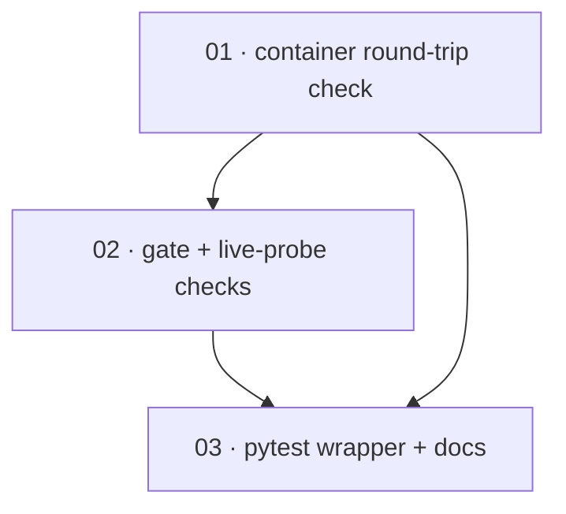

# Plan: Add live in-container runtime verification

**Status:** Done · **Layout:** kanban · **Date:** 2026-05-28 · **Owner:** Ant Stanley · **Source spec:** [changes/2026-05-28-add_live_container_verification.md](../../benchmark/specs/changes/merged/2026-05-28-add_live_container_verification.md)

> **Built 2026-05-28 (spec-builder).** All three tasks `Done`, each through both gates run by an agent other than the implementer. 01 — semi-formal-review LIKELY_CORRECT (one host-side fault found and fixed: a doubled `REPO_SUBDIR` that had silently disabled the content-integrity half), validate-done DONE. 02 — LIKELY_CORRECT, DONE. 03 — CORRECT, DONE. Integrated on the `spec-workflow-benchmark` line; `uv run pytest benchmark/tests` green (332 passed, 7 skipped — the 7th skip is the new container witness; the live Docker/`claude -p` path is gated and reviewed by reading). Produced `benchmark/harness/run_container_check.py` and `benchmark/tests/test_live_container.py`; documented the `BENCHMARK_RUN_CONTAINER_LIVE` opt-in in `benchmark/README.md`.

Build the opt-in live runtime-verification path the change spec proposes: a `benchmark/harness/run_container_check.py` entrypoint, gated by `BENCHMARK_RUN_CONTAINER_LIVE=1`, that exercises the already-shipped `container` `RunBackend` / `ScoringBackend` two-container split end to end on real Docker, plus a default-skipped `benchmark/tests/test_live_container.py` pytest wrapper. The decomposition is three thin vertical slices ordered for reviewability: **01** stands up the entrypoint with its opt-in/skip guard and the core integrity witness (A0 round-trip + resolved-parity vs the `local` backend + a runtime check that the run image carries no hidden tests); **02** extends it with the gate-emission checks (A2 emits gate events, A3 does not) and the live `claude -p` gate-probe assertion; **03** adds the default-skipped pytest wrapper and the README opt-in docs. The verification layers over shipped code — no domain, schema, arm, or metric changes — so every task's CI-visible definition of done centres on the *skip path* (clean skip without Docker / the env var) and structure/type/lint gates, with the live assertions reviewed by reading. The live path itself runs only on an operator host with Docker + an authenticated `claude` CLI.

---

## Source and definition-of-done baseline

- **Spec.** [changes/2026-05-28-add_live_container_verification.md](../../benchmark/specs/changes/merged/2026-05-28-add_live_container_verification.md) — the whole change spec is in scope; its `Proposed changes` target [05-harness-architecture.md](../../benchmark/specs/05-harness-architecture.md) (new §Runtime verification) and [06-scoring-and-statistics.md](../../benchmark/specs/06-scoring-and-statistics.md) (§Gate-efficacy probes). The schema sidecar is unchanged. The canonical prose is applied at *merge* (after this plan is built), so each task's `Implements` points at the change spec's sections, not yet-merged canonical headings.
- **Already built (preconditions, not tasks).** Confirmed by the 2026-05-28 R2 spec-vs-code review. `ContainerRunBackend` (`benchmark/harness/backends/container.py:332` — `run`, `last_gate_events:775`, `last_merge_conflicts:669`) and `ContainerScoringBackend`; `LocalScoringBackend` and the single-sourced resolution rule (`benchmark/harness/scoring/resolution.py`); arms A0/A2/A3 (`benchmark/harness/arms/`); the driver `run_campaign` + `TrialResult.gate_events` threading (`benchmark/harness/driver/scheduler.py`); the live gate probe `run_gate_probe` / `cli_review_gate` / `DEFECT_MUTATIONS` (`benchmark/harness/scoring/probes/{live,defects}.py`); the greenfield `text_toolkit` instance with a `reference/solution.patch` and `greenfield_images.docker_available` / `build_images` (`benchmark/suites/`). This plan writes only the verification harness over that surface.
- **Definition of done.** Inherited from [`.specs/development-guidelines.md`](../../development-guidelines.md) §Testing, §Limits and bounds, §Python conventions: Python 3.13 under `uv`; `ruff` lint+format clean (`E,F,I,UP,B`); `pyright` standard clean (library only); `pytest` green via `uv run pytest benchmark/tests`; every limit (env-var name, budget cap, timeout) a named `SCREAMING_SNAKE_CASE` constant; positive **and** negative space (here: the negative space is the *skip* path — clean skip when the env var is unset / Docker is absent). Each task file adds its task-specific acceptance on top.

---

## Task graph

The dependency table is the **source of truth**; the Mermaid graph visualizes it.

| Task | Depends on | Edge kind | Produces (reviewable artifact) |
|---|---|---|---|
| [01 container round-trip check](01-container_round_trip_check.md) | — | — | `BENCHMARK_RUN_CONTAINER_LIVE=1 python -m benchmark.harness.run_container_check` runs A0 end to end on Docker, asserting resolved-parity vs the `local` backend and a hidden-test-free run image; without the env / Docker it skips with a clear message |
| [02 gate + live-probe checks](02-gate_and_live_probe_checks.md) | 01 | build | the self-test additionally asserts A2 emits ≥ 1 `GateEvent` / A3 emits zero (threaded onto `TrialResult`), and that the live `claude -p` gate probe catches an injected defect |
| [03 pytest wrapper + docs](03-pytest_wrapper_and_docs.md) | 01, 02 | build, review | `uv run pytest benchmark/tests/test_live_container.py` SKIPs cleanly without the env var; `benchmark/README.md` documents the opt-in and its prerequisites |

Each row links to its task file. `Depends on` references lower task numbers. Edge kinds: 02 *builds on* 01's module; 03 *builds on* the module and is a *review* wrapper over the full 01+02 surface.

---

## Implementation order and milestones

**Order:** `01, 02, 03`. Task 01 leads because it establishes the entrypoint, the opt-in/skip discipline, and the integrity witness that is the change's whole reason to exist — the run/scoring split observed at runtime; everything else extends or wraps it. 02 adds the gate and live-probe coverage onto the same module. 03 is last because the pytest wrapper and the docs describe the complete self-test surface, so they want 01+02 in place.

**Milestones:**

| Milestone | Tasks | Demonstrable when complete | Review gate |
|---|---|---|---|
| M1 — integrity witness | 01 | An operator runs the module on Docker and sees A0 resolve identically on the `container` and `local` backends with a verified-clean run image; a non-operator runs it without the env and sees a clean skip | 01's DoD met; module imports and skips cleanly under `uv run` with no Docker |
| M2 — full coverage, integrated | 02, 03 | The self-test also proves A2/A3 gate emission and the live `claude -p` catch, and `pytest` picks it up as a default-skipped test the README explains | 02 + 03 DoD met; `uv run pytest benchmark/tests` stays green (the new test SKIPs) |

---

## Assumptions and open questions

**Assumptions**

- The container backend, the live gate probe, the greenfield `text_toolkit` instance (with its `reference/solution.patch`), and the driver gate-event threading are all shipped and behave as the R2 review found; this plan adds no functional code to them.
- The live assertions cannot be executed in CI or in this build environment (no Docker, no authenticated `claude` CLI), so they are gated and reviewed by reading; the *skip* path is what the build verifies, exactly as the existing `BENCHMARK_RUN_GATE_PROBE_LIVE` tests do.

**Decisions**

- *Single entrypoint, thin pytest wrapper.* **The verification logic lives in `run_container_check.py`; `test_live_container.py` is a `skipif` wrapper that calls it.** Keeps the logic single-sourced and runnable both as a module (operator) and under pytest (CI skip), mirroring `run_local_demo.py` + its test.
- *Three slices, not seven.* **The change spec's seven implementation steps fold into three reviewable packages.** Steps 1–3 are one coherent integrity witness (01); steps 4–5 are the gate/probe extension (02); steps 6–7 are the pytest+docs surface (03). Each milestone ends at something a reviewer can exercise.
- *Certificates derived from the DoD.* **No separate done-certificate files are authored for this plan.** It is small and the per-task `Definition of done` checklists are explicit; the build's `validate-done-certificate` gate derives its obligations from those checklists. A later pass can add `certificates/` if wanted.

**Open questions**

- *Arm coverage.* Is A0 (round-trip) + A2/A3 (gate emission) + the live probe a sufficient runtime witness, or must 02 also drive A1/A4? Carried from the change spec.
- *Evidence freshness.* Should a green live run auto-overwrite the committed `_a*_live_evidence/` bundles, or write to a scratch path an operator promotes? Affects 03's evidence-refresh step. Carried from the change spec.
- *Authenticated CLI in headless runs.* How is the `claude` CLI provisioned for the live `claude -p` step without leaking credentials into the captured bundle? Carried from the change spec; blocks an unattended live run, not the build.
