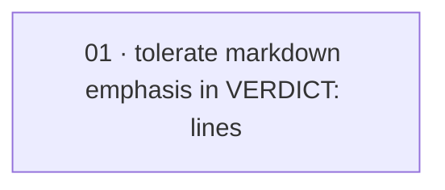

# Plan: Tolerate markdown emphasis in discharged `VERDICT:` lines

**Status:** Proposed · **Date:** 2026-05-29 · **Owner:** Ant Stanley · **Source spec:** [changes/2026-05-29-tolerate_markdown_verdict_lines.md](../../benchmark/specs/changes/merged/2026-05-29-tolerate_markdown_verdict_lines.md)

> Single-task plan: widen two label regexes in `a2_a3.py` to tolerate markdown emphasis around the `VERDICT:` label, plus a regression test on the real live `**VERDICT:** DONE` shape. No domain, schema, arm, or metric change.

The live `validate-done-certificate` gate writes its done-certificate verdict line markdown-BOLD under a `## Verdict` heading (`**VERDICT:** DONE`), but `extract_gate_events` required a BARE label (`\bVERDICT:\s*(…)\b`), so the closing `**` between the colon and `DONE` defeated the regex: A2 emitted zero `GateEvent`s and falsely looked ungated, failing the live `test_live_a2_emits_gate_events_and_a3_emits_none`. The fix makes both `_VALIDATE_VERDICT_RE` and `_REVIEW_VERDICT_RE` tolerate optional `*`/`_` emphasis runs around the label and between the colon and the verdict token, keeping `re.IGNORECASE` and leaving the blank-marker skip and the verdict-to-enum maps unchanged. The work is one reviewable slice — two regex edits plus the regression test that locks the live shape.

---

## Source and definition-of-done baseline

- **Spec.** [changes/2026-05-29-tolerate_markdown_verdict_lines.md](../../benchmark/specs/changes/merged/2026-05-29-tolerate_markdown_verdict_lines.md) — its `Proposed changes` target [06-scoring-and-statistics.md](../../benchmark/specs/06-scoring-and-statistics.md) → §Gate-efficacy probes (*Live-probe verdict mapping*). The canonical prose is applied at *merge* by the integrating orchestrator, so the task points at the change spec's section, not a yet-merged canonical heading. The schema sidecar is unchanged.
- **Already built (preconditions, not tasks).** `extract_gate_events`, the `_BLANK_VERDICT_MARKER` skip, the `_VALIDATE_VERDICT_MAP` / `_REVIEW_VERDICT_MAP` mappings, and the double-count-by-design over the (validate, review) regex pair (`benchmark/harness/arms/a2_a3.py`). This plan only widens the two label regexes and adds the regression test.
- **Definition of done.** Inherited from [`.specs/development-guidelines.md`](../../development-guidelines.md) §Testing, §Python conventions: Python 3.13 under `uv`; `ruff` lint+format clean; `pyright` standard clean; `pytest` green via `uv run pytest benchmark/tests -q`; positive **and** negative space (positive = the bold live shape now registers; negative = the A3 blank-marker case still yields no event, and the bare shape is unregressed). The task adds its task-specific acceptance on top.

---

## Task graph

The dependency table is the **source of truth**; the Mermaid graph visualizes it.

| Task | Depends on | Edge kind | Produces (reviewable artifact) |
|---|---|---|---|
| 01 tolerate markdown emphasis in `VERDICT:` lines | — | — | `_VALIDATE_VERDICT_RE` / `_REVIEW_VERDICT_RE` match bare AND emphasised labels; a captured `**VERDICT:** DONE` certificate yields exactly one validate PASS GateEvent; blank-marker / bare / no-double-count regressions hold; full validation gate green |

### Task 01 — definition of done

- `_VALIDATE_VERDICT_RE` and `_REVIEW_VERDICT_RE` in `benchmark/harness/arms/a2_a3.py` match the verdict line tolerant of optional markdown emphasis around the label and between the colon and the verdict token — verified against all of `VERDICT: DONE`, `**VERDICT:** DONE`, `*VERDICT:* PARTIAL`, `**VERDICT:**  NOT_DONE`, `__VERDICT:__ DONE` (and the review vocabulary). `re.IGNORECASE` is kept; the constant docstrings note the emphasis tolerance and WHY (the live gate bolds the label).
- The `_BLANK_VERDICT_MARKER` skip, the `_VALIDATE_VERDICT_MAP` / `_REVIEW_VERDICT_MAP` mappings, and the up-to-two-events-per-certificate design are UNCHANGED — an A3 `**Verdict:** (blank …)` certificate still yields no event, and a single bold verdict line yields exactly one.
- Regression test added to `benchmark/tests/test_a2_a3_arms.py`: a captured certificate whose verdict line is the real live shape (`## Verdict` + `**VERDICT:** DONE`) yields exactly one validate GateEvent mapped to `PASS`; the bare `VERDICT: DONE` still yields one PASS event; `*VERDICT:* PARTIAL` maps to PARTIAL.
- Focused proof passes: `extract_gate_events` on a single `## Verdict` + `**VERDICT:** DONE` entry returns 1 event with `(validate-done-certificate, PASS)`.
- Validation gate green: `uv run ruff format` (changed `.py`) clean, `uv run ruff check benchmark` clean, `uv run pyright benchmark/harness` clean, `uv run pytest benchmark/tests -q` green.

---

## Implementation order and milestones

**Order:** `01` (single task). It is self-contained: the two regex edits and the regression test ship together so the change is reviewable as one diff.

**Milestones:**

| Milestone | Tasks | Demonstrable when complete | Review gate |
|---|---|---|---|
| M1 — emphasis-tolerant parser, regression-guarded | 01 | A captured `**VERDICT:** DONE` certificate registers as one validate PASS GateEvent; the A3 blank case and the bare shape are unregressed | 01 DoD met; `uv run pytest benchmark/tests -q` green with the added live-shape assertions |

---

## Assumptions and open questions

**Assumptions**

- The only styling the live gate applies to the label is markdown emphasis (`*`/`_` runs); the verdict token itself is always bare. The `[*_]*` runs cover the observed bold shape and the equally-valid italic / underscore-bold shapes (carried from the change spec).
- The captured certificate body preserves the literal `**VERDICT:** DONE` line (the merged-certificate capture is byte-faithful), so a single regex pass over the captured bytes is sufficient.

**Decisions**

- *One task, not several.* **The two regex edits and the regression test are one reviewable slice.** There is no dependency to sequence; a single gated task keeps the change atomic.
- *Certificate derived from the DoD.* **No separate done-certificate file is authored.** The task's `Definition of done` checklist is explicit; the build's `validate-done-certificate` gate derives its obligations from it.

**Open questions**

- *Live re-run.* Should the live A2/A3 container witness be re-run under the fix to confirm freshly-generated bolded certificates register `>= 1` GateEvent end to end, before the change spec is marked `Merged`? The build proves it against a captured-shape fixture; only a live run proves the end-to-end path. (Carried from the change spec.)
