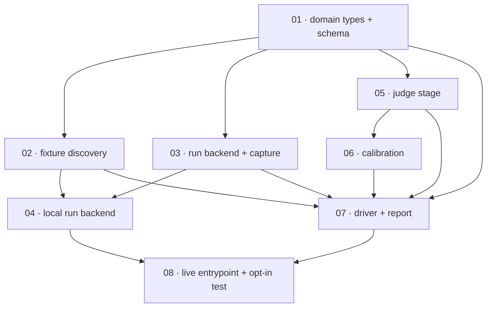

# Plan: Implement the eval-judge harness

**Status:** Draft · **Date:** 2026-05-30 · **Owner:** Ant Stanley · **Source spec:** [.specs/evaljudge/specs/](../../evaljudge/specs/00-overview.md)

Build the eval-judge harness specified at `.specs/evaljudge/specs/` — a tool that runs each `spec-*` skill's `evals/evals.json` fixtures live and LLM-judges the skill's actual behavior against each fixture's `expected_output`. The harness lives under `benchmark/evaljudge/` and **reuses the benchmark's conformance-judge machinery** (`benchmark/harness/scoring/conformance/judge.py` + `calibration.py`) rather than reinventing the LLM-judge plumbing. The decomposition is eight packages on a single reviewability spine: the **domain types + schema** (01) come first because every later record validates against them; **fixture discovery** (02) makes the eight real `evals.json` files readable and is the cheapest end-to-end win; the **run stage** (03–04) is the riskiest new surface — capturing real skill behavior under the run/judge isolation rule — so it is built and proven before the **judge stage** (05) that consumes it; **calibration** (06) sets the pass threshold against human labels; the **driver + report** (07) wire the two stages into a sweep; and the **opt-in live entrypoint** (08) makes the whole thing runnable and gated like the repo's other `*_LIVE` self-tests. Every package's CI-visible definition of done rests on the **hermetic path** (injected fake `RunBackend` + fake `JudgeCallable`, no model call) so `scripts/check.sh` stays green and Docker-free; the live path is reviewed by reading and exercised only by an operator with an authenticated `claude` CLI.

---

## Source and definition-of-done baseline

- **Spec.** [`.specs/evaljudge/specs/`](../../evaljudge/specs/00-overview.md) — the whole set is in scope: [00-overview](../../evaljudge/specs/00-overview.md), [01-domain-model](../../evaljudge/specs/01-domain-model.md), [02-run-stage](../../evaljudge/specs/02-run-stage.md), [03-judge-stage](../../evaljudge/specs/03-judge-stage.md), [04-report-and-cli](../../evaljudge/specs/04-report-and-cli.md), [05-architecture](../../evaljudge/specs/05-architecture.md), and the [`canonical-types.schema.json`](../../evaljudge/specs/canonical-types.schema.json) sidecar. The spec is `Status: Draft` — it is the build target; when the harness ships, the spec flips to `Built` and any divergence becomes change-spec material.
- **Already built (preconditions, not tasks).** The benchmark's **conformance judge** is shipped and is the reuse base, confirmed by reading the code: `benchmark/harness/scoring/conformance/judge.py` (`JudgeCallable`, `clamp_score`, `SCORE_MIN`/`SCORE_MAX`, `parse_judge_response`, `build_rubric_prompt`, `cli_judge`, the bounded-`claude -p` pattern) and `calibration.py` (`bucket_of`, the `low/partial/high` bands, `cohens_kappa`, `compute_agreement`, the sample/threshold shape). The benchmark domain-record discipline (frozen dataclasses validating against a hand-authored schema, `<prefix>_<uuid7>` ids, `new_record_id`) in `benchmark/harness/domain.py` is the pattern the new records follow. The eight `plugins/*/skills/*/evals/evals.json` fixtures exist and share one shape. None of `benchmark/evaljudge/` exists yet — this plan writes all of it.
- **Definition of done.** Inherited from [`.specs/development-guidelines.md`](../../development-guidelines.md) §Definition of done, §Testing, §Limits and bounds, §Python conventions: Python 3.13 under `uv`; `ruff format --check` + `ruff check` clean (`E,F,I,UP,B`); `pyright` standard clean (library only — tests excluded); `pytest` green via `uv run pytest benchmark/tests`; every limit (model alias, budget cap, timeout, pool size, sweep cap, pass threshold, calibration bars) a named `SCREAMING_SNAKE_CASE` constant; frozen dataclasses validated against the schema on construction and load; closed string sets over free strings; typed exceptions with context, no bare `except`, no `None`-as-error; positive **and** negative space (here the negative space is the malformed-fixture path, the non-completed-run path, and — for the live entrypoint — the clean skip without `EVALJUDGE_RUN_LIVE`). Each task file adds task-specific acceptance on top; equivalently, `scripts/check.sh` passes.

---

## Task graph

The dependency table is the **source of truth**; the Mermaid graph visualizes it. If the two disagree, the table wins.

| Task | Depends on | Edge kind | Produces (reviewable artifact) |
|---|---|---|---|
| [01 domain types + schema](01-domain_types_and_schema.md) | — | — | `EvalCase`/`EvalRun`/`EvalJudgment`/`EvalResult`/`EvalReport` frozen dataclasses round-trip through `to_dict`/`from_dict` and validate against a hand-authored `canonical-types.schema.json`; a test asserts in-memory schema == on-disk file |
| [02 fixture discovery](02-fixture_discovery.md) | 01 | build, data | discovery globs the repo's eight real `evals.json` files into validated `EvalCase` records; a malformed fixture raises a typed `FixtureValidationError` and is reported, not scored |
| [03 run backend + capture](03-run_backend_and_capture.md) | 01 | build, contract | the `RunBackend` Protocol, the **redacted-case** view (no `expected_output`), and behavior capture (response + working-dir file diff → `EvalRun`); a fake backend drives it hermetically |
| [04 local run backend](04-local_run_backend.md) | 02, 03 | build | the `local` Docker-free backend invokes a skill via one bounded `claude -p` in a temp dir, classifying `completed`/`run_failed`/`timed_out`/`budget_exceeded`; budget/timeout/model/temp-base all named constants |
| [05 judge stage](05-judge_stage.md) | 01 | build, contract | `score_eval(expected_output, EvalRun) → EvalJudgment` reusing the conformance judge's `JudgeCallable`/`parse_judge_response`/`clamp_score`; the eval-conformance rubric + prompt builder; score→band→`PASS`/`FAIL` via a named threshold |
| [06 calibration](06-calibration.md) | 05 | build, data | a small human-labelled sample + agreement computation (reusing the conformance bands + `cohens_kappa`); `PASS_THRESHOLD` justified against a reported agreement figure, not picked by feel |
| [07 driver + report](07-driver_and_report.md) | 02, 03, 05, 06 | build, contract | the sweep driver (run → judge → derive, pooled, capped, one bad case degrades to `NOT_RUN`) and the `EvalReport` (JSON artifact + summary, overall + `by_skill` pass rate) — runs fully hermetically with both seams faked |
| [08 live entrypoint + opt-in test](08-live_entrypoint_and_opt_in_test.md) | 04, 07 | build, review | `uv run -m benchmark.evaljudge.run_sweep` runs a real bounded sweep under `EVALJUDGE_RUN_LIVE=1` and sets exit status; a default-skipped `test_evaljudge_live.py` SKIPs cleanly without the env var; `benchmark/README.md`/`.specs/evaljudge/README.md` document the opt-in |

Each row links to its task file. Every `Depends on` references a **lower** task number — the property guaranteed by numbering in implementation order: the schema floor (01) leads and the live entrypoint (08) is last. Edge kind names why the dependency exists — build / data / contract / review.

---

## Implementation order and milestones

**Order:** `01, 02, 03, 04, 05, 06, 07, 08`. The schema floor (01) leads because every other package constructs records that validate against it — it is reviewed-through by all of them (the auth-before-gated-features rule, in schema form). Discovery (02) comes next: it is the cheapest package that touches real repo data end to end (the eight live fixtures) and de-risks the fixture-shape assumption while nothing depends on it yet. The run stage (03 then its `local` impl 04) precedes the judge (05) because capturing real behavior under the isolation rule is the riskiest new surface and the judge consumes its output — retire that risk first. The judge (05) reuses proven machinery so it is low-risk; calibration (06) immediately follows to set the threshold the judge's verdict needs. The driver+report (07) waits on both stages and discovery so it can wire a complete hermetic pipeline. The live entrypoint (08) is last: it makes the whole sweep runnable and gates it, so it wants 04 (a real run backend) and 07 (a complete pipeline) in place.

**Milestones:**

| Milestone | Tasks | Demonstrable when complete | Review gate |
|---|---|---|---|
| M1 — types + readable fixtures | 01, 02 | the five records round-trip and validate against the on-disk schema; discovery reads all eight real `evals.json` into `EvalCase`s and rejects a malformed one with a typed error | 01 + 02 DoD met; `uv run pytest benchmark/tests` green; schema-equality test passes |
| M2 — behavior captured under isolation | 03, 04 | a fake backend captures response + file-changes into an `EvalRun`; the `local` backend's redacted-case view structurally omits `expected_output`; non-completed runs classify correctly (tested with a stubbed subprocess) | 03 + 04 DoD met; isolation test proves the backend never receives `expected_output`; hermetic suite green |
| M3 — judged + calibrated | 05, 06 | `score_eval` turns an `EvalRun` + `expected_output` into a clamped score, band, and PASS/FAIL via a deterministic injected judge; the calibration sample reports an agreement figure and `PASS_THRESHOLD` clears its bar | 05 + 06 DoD met; verdict-derivation and calibration tests green; primitives imported from the conformance judge, not duplicated |
| M4 — swept + runnable | 07, 08 | the driver runs the full discover→run→judge→report pipeline hermetically and emits an `EvalReport` with per-skill pass rates; `run_sweep` SKIPs cleanly without `EVALJUDGE_RUN_LIVE`, and an operator can run one real bounded eval end to end | 07 + 08 DoD met; full hermetic pipeline test green; live test SKIPs in CI; READMEs document the opt-in |

---

## Assumptions and open questions

**Assumptions**

- The conformance judge's public surface (`JudgeCallable`, `clamp_score`, `parse_judge_response`, `SCORE_MIN`/`SCORE_MAX`, `build_rubric_prompt`, and the calibration helpers) is importable from `benchmark.harness.scoring.conformance` and stable enough to depend on; reused in place, not forked (per [05-architecture.md](../../evaljudge/specs/05-architecture.md) §Reuse).
- The repo's `pyproject.toml` `testpaths`, ruff, and pyright config extend to a new `benchmark/evaljudge/` subpackage and `benchmark/tests/test_evaljudge_*.py` without structural change (a new package under an already-included tree).
- The eight current `evals.json` files all validate against the fixture shape in [02-run-stage.md](../../evaljudge/specs/02-run-stage.md); a file that does not is a fixture defect the harness surfaces, found during task 02.
- The live path (tasks 04, 08) cannot run in CI or this build environment (no authenticated `claude` CLI), so its model-calling assertions are reviewed by reading; the hermetic fake-backed path is what the build verifies, exactly as the benchmark's `BENCHMARK_RUN_*_LIVE` tests do.

**Decisions**

- *Schema floor leads.* **01 (domain types + schema) is built first.** Every record in every later package validates against `canonical-types.schema.json`; building and pinning it first means each subsequent package is reviewed against a fixed contract, and the schema-equality test guards drift from line one. This is the reviewability-ordering rule — build the enabler everything is reviewed-through first — which is why it leads even though discovery (02) is the cheaper standalone win.
- *Run stage before judge stage.* **03+04 precede 05 even though the judge is the headline feature.** The judge is a low-risk reuse of proven code; the run stage — capturing real skill behavior under the run/judge isolation rule — is the genuinely new, risky surface, so it is built and proven while little depends on it (the retire-risk-early rule).
- *Two injectable seams, hermetic by default.* **`RunBackend` (03) and `JudgeCallable` (05, imported) are both fakeable, so 07's pipeline test and every earlier test run with no model call.** This keeps the whole build inside `scripts/check.sh` and Docker-free; the live path is one opt-in entrypoint (08), matching the benchmark's posture.
- *Reuse, don't fork, the judge primitives.* **05 imports `clamp_score`/`parse_judge_response`/`JudgeCallable`/the bands from the conformance judge.** Forking them would create two parse/clamp/band implementations to keep in sync; the spec's whole architecture rests on this reuse.
- *Certificates derived from the DoD, not separately authored.* **No `certificates/` subfolder for this plan.** This is a non-interactive delegated planning call (no user to prompt), and the repo's recent plans (e.g. [`2026-05-28-add_live_container_verification`](../2026-05-28-add_live_container_verification/plan.md)) deliberately skip separate certificate files where the per-task `Definition of done` checklists are explicit; the build's `validate-done-certificate` gate derives its obligations from those checklists. A later pass can add `certificates/` with the `done-certificates` skill if wanted.

**Open questions**

- *Plugin install mechanics for the live run.* The exact non-interactive way to make a local plugin available to `claude -p` (a `--plugin-dir`-style flag, a marketplace install, or a config shim) is unsettled in the spec ([02-run-stage.md](../../evaljudge/specs/02-run-stage.md) Open questions) and must be pinned in the build environment before task 04's live path runs. Blocks the live path, not the hermetic build.
- *Pass threshold value and calibration sample size.* `PASS_THRESHOLD` and the calibration-sample size that makes the verdict trustworthy are open until task 06 runs a real labelling pass ([03-judge-stage.md](../../evaljudge/specs/03-judge-stage.md) Open questions). Task 06 ships an honest small seed and a documented placeholder threshold; tightening it is follow-up.
- *Container run backend.* The spec defines only the `local` backend and leaves a `container` backend as an Open question ([02-run-stage.md](../../evaljudge/specs/02-run-stage.md)). Not planned here; the `RunBackend` Protocol (03) leaves room to add it without touching the judge or report.
- *Promoting shared schema primitives.* `RecordId`/`Slug`/`Timestamp` now appear in both the benchmark and eval-judge schemas; whether that is the two-app trigger to lift them into a global `.specs/canonical-types.schema.json` ([05-architecture.md](../../evaljudge/specs/05-architecture.md) Open questions) is deferred — task 01 re-declares them per-app per the layering rule.
