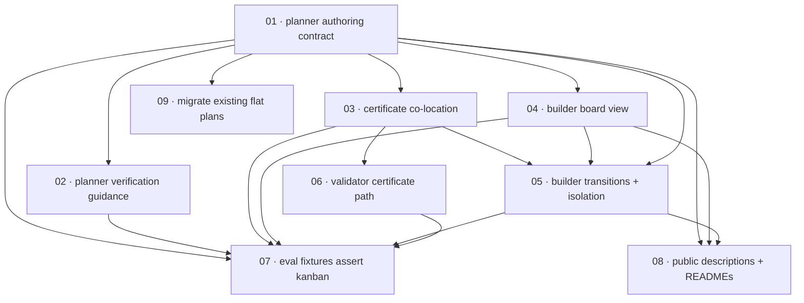

# Plan: Kanban plan-folder layout

**Status:** Done · **Layout:** kanban · **Date:** 2026-06-06 · **Owner:** Ant Stanley · **Source spec:** [.specs/changes/2026-06-05-kanban_plan_folder_layout.md](../../changes/2026-06-05-kanban_plan_folder_layout.md)

Convert the `spec-planner`/`spec-builder` plan-folder contract from a flat layout (`NN-task.md` files + a `certificates/` subfolder + a per-task `**Status:**` field) to a **kanban board of folders** — `plan.md` at the root plus `backlog/`, `in-progress/`, `blocked/`, and `done/` subfolders that each task file and its co-located `NN-task-certificate.md` physically move between, so a task's folder *is* its status. The work is sliced by **file ownership**: each of nine task packages owns a disjoint set of files and converts them fully to the kanban model, implementing whichever of the change spec's rule-blocks (A–H) land in those files. The reviewability spine is **contract-first** — the planner authoring contract (01) defines the four-folder board, the number-only task references, the one-level-deeper link depth, the `**Layout:** kanban` marker, and certificate co-location *once*, and every other task conforms to it: the planner's own checklist/decomposition guidance (02), done-certificates (03), the spec-builder orchestrator view (04) and its transition/isolation mechanics (05), the validator's certificate path (06), the four eval golden outputs (07), the public descriptions/READMEs (08), and an in-place migration of the seven existing flat plans (09). Because `plugins/` is canonical and `skills/` is regenerated from it, every task that edits a plugin file re-runs `scripts/sync-skills.sh`; the operative gate throughout is `scripts/check.sh` (which fails on `skills/` drift), not the Python suite — this change touches no Python.

---

## Source and definition-of-done baseline

- **Spec.** [`.specs/changes/2026-06-05-kanban_plan_folder_layout.md`](../../changes/2026-06-05-kanban_plan_folder_layout.md) — the whole change spec is in scope. Its `Proposed changes` blocks A–H are the content the tasks land; its `Affected spec pages` table and `Implementation notes` name the files and order. The "canonical pages" are the plugin source files themselves (`plugins/spec-planner/**`, `plugins/spec-builder/**`), not a `.specs/` page — the plugins are their own canonical definition.
- **Already built (preconditions, not tasks).** The entire **flat** layout contract exists and ships today: every affected `SKILL.md`, reference file, and `evals.json` currently describes the flat layout, the `certificates/` subfolder, and the per-task `Status:` field (confirmed by a file-by-file read — anchors in each task's `Pointers`). The seven existing flat plans under [`.specs/plans/`](..) exist and are inventoried in task 09. The sync tooling (`scripts/sync-skills.sh`, `scripts/check.sh`) and the regenerated `skills/` tree exist. Nothing of the kanban layout exists yet — this plan writes the whole delta.
- **Definition of done.** Inherited from [`.specs/development-guidelines.md`](../../development-guidelines.md) §Definition of done, §Repository hygiene, §Version control — but this is a markdown + JSON + plan-migration change with **no executable code**, so the Python items (ruff/pyright/pytest) are satisfied by *staying green and untouched*, and the operative per-task gate is twofold: (1) **`scripts/check.sh` passes**, whose live assertion here is `scripts/sync-skills.sh --check` — so every task that edits a plugin `SKILL.md` *or reference file* (01–06) must re-run `scripts/sync-skills.sh` before the gate, or `check.sh` fails on `skills/` drift; (2) **internal coherence** — the edited files describe the kanban layout consistently, with no residual flat-layout/`certificates/`-subfolder/`Status:`-field wording, and the two cross-file invariants below hold. The un-synced, un-drift-checked surfaces — the four `evals.json` (07), the two `plugin.json` descriptions and two READMEs (08), and the `.specs/plans/` migration (09) — are hand-edited; `check.sh` still passes for them (they sit outside the synced tree and outside Python). Conventional Commits subject; `jj` is the version-control front end.

**Cross-file invariants** (they span tasks, so each owning task asserts its slice and the reviewer checks the whole):

- **Link depth — identical in four places.** The one-level-deeper spec-link depth (`../../../foo.md` for a global page, `../../../<package>/specs/NN-name.md` for a per-package page) must read identically in `plan-template.md` (01), `checklist.md` (02), `subagent-brief.md` (05), and the spec-planner eval (07). If they diverge, the builder resolves spec links at a different depth than the planner verifies.
- **Worked example — identical everywhere.** The `01-passphrase_lock …` journal-app example appears in `plan-template.md` (01), `task-decomposition.md` (02), `certificate-template.md` (03), and the four eval fixtures (07). Update it identically so no stale copy reintroduces the flat layout.

---

## Task graph

The dependency table is the **source of truth**; the Mermaid graph visualizes it. If the two disagree, the table wins — fix the graph to match.

| Task | Depends on | Edge kind | Produces (reviewable artifact) |
|---|---|---|---|
| [01 planner authoring contract](01-planner_authoring_contract.md) | — | — | the canonical kanban layout fully specified in the planner `SKILL.md` + `plan-template.md` — four-folder board, no per-task `Status:` field, number-only dependency table, `../../../` link depth, `**Layout:** kanban` header, co-located certificates; a planner author can author a kanban plan |
| [02 planner verification guidance](02-planner_verification_guidance.md) | 01 | contract, review | `checklist.md` + `task-decomposition.md` conformed to the kanban contract — four-subfolder checks, number references, the depth rule, and `NN`-as-identity that survives folder moves |
| [03 certificate co-location](03-certificate_colocation.md) | 01 | contract | done-certificates authors a co-located `NN-task-certificate.md` beside its still-unbuilt task in `backlog/` (no `certificates/` subfolder), same-directory cross-links, and a next-free-`NN` that spans the four folders |
| [04 builder board view](04-builder_board_view.md) | 01 | contract | spec-builder enumerates the task set as the union of the four subfolders, derives ready/running/blocked/done from folder membership, recomputes `plan.md`'s `Status` from the subfolders, and detects + migrates legacy-flat plans |
| [05 builder transitions + isolation](05-builder_transitions_and_isolation.md) | 01, 03, 04 | build, contract | a status transition is a serialized main-tree file move (task + its certificate) into `in-progress/`, `done/`, or `blocked/`; spec-link depth +1; sub-agents never touch the plan folder |
| [06 validator certificate path](06-validator_certificate_path.md) | 03 | contract | validate-done-certificate reads the co-located `NN-task-certificate.md` from the task's current subfolder on the main tree, not from a `certificates/` path |
| [07 eval fixtures assert kanban](07-eval_fixtures_kanban.md) | 01, 02, 03, 04, 05, 06 | data, review | all four `evals.json` golden outputs assert the four-folder board, co-located certificates, number-only references, and folder-move transitions; the shared worked example is identical across them |
| [08 public descriptions + READMEs](08-public_descriptions_and_readmes.md) | 01, 04, 05 | review | both `plugin.json` descriptions and both plugin `README.md` files reworded to folder-as-status with co-located certificates — the un-synced, un-checked surface |
| [09 migrate existing flat plans](09-migrate_existing_flat_plans.md) | 01 | data | the seven existing `.specs/plans/` folders migrated in place to the kanban layout — task files filed by status, certificates co-located, `**Layout:** kanban` stamped |

Each row links to its task file. Every `Depends on` references a **lower** task number — the property guaranteed by numbering in implementation order. Edge kind names why the dependency exists — build / data / contract / review (see [task-decomposition.md](../../../plugins/spec-planner/skills/spec-planner/references/task-decomposition.md)).

---

## Implementation order and milestones

**Order:** `01, 02, 03, 04, 05, 06, 07, 08, 09`. The **planner authoring contract (01) leads** because every other task conforms to the layout it defines — the four-folder board, number-only task references, the `../../../` depth, the `**Layout:** kanban` marker, and certificate co-location. It is the enabler reviewed-through by everything downstream (the auth-before-gated-features rule, in contract form), so it is built and pinned first. Once 01 lands, **02, 03, 04, and 09 are all ready in parallel** (each depends only on 01): 02 keeps the planner's own checklist/decomposition consistent and clusters with 01 as "the planner, fully converted"; 03 (certificate co-location) and 04 (builder board view) are the cross-plugin enablers that unlock 05 (which needs both, plus the 01 contract for its link-depth conformance) and 06 (which needs 03); 09 (migration) is an independent operational pass that needs only the target shape. **07 (fixtures) waits on every skill** because each golden output asserts its skill's final shape; **08 (public prose)** follows the layout (01) and the build-loop mechanics (04, 05). The order is biased so the contract and its two cross-plugin enablers (03, 04) precede the work that is reviewed *through* them.

**Milestones:**

| Milestone | Tasks | Demonstrable when complete | Review gate |
|---|---|---|---|
| M1 — Contract | 01 | the canonical kanban layout is fully specified — a planner author can author a kanban plan, and a reader knows the four-folder board, the no-`Status:`-field rule, number-only references, `../../../` depth, the `**Layout:** kanban` marker, and certificate co-location | 01 DoD met; `scripts/sync-skills.sh` run and `scripts/check.sh` green (no `skills/` drift); the contract is settled before any conformer builds against it |
| M2 — Conformance | 02, 03, 04, 05, 06 | every skill's docs across both plugins coherently describe the kanban layout — the planner's checklist/decomposition, done-certificates, and all of spec-builder (reading, transitions, isolation, validation) — with no flat-layout residue | 02–06 DoD met; each reads coherently against the M1 contract; `scripts/check.sh` green; the two cross-file invariants hold; `semi-formal-review` and the reasoning-method triangle untouched |
| M3 — Assertions, surfaces, migration | 07, 08, 09 | the four eval golden outputs assert the kanban layout, both `plugin.json` descriptions + READMEs match, and an `ls` of each of the seven existing plans shows the kanban board (task files filed by status, co-located certificates, no `certificates/` subfolder) | 07–09 DoD met; `scripts/check.sh` green end-to-end; spot-check one migrated plan and the four golden outputs |

---

## Assumptions and open questions

**Assumptions**

- This plan is authored under the **current flat-layout** spec-planner skill, so the plan folder itself is flat — `plan.md` at the root, `NN-task.md` files beside it, a `certificates/` subfolder, and a per-task `**Status:**` field. The very change it plans will later migrate this folder too (task 09 migrates the seven *existing* plans; this new one is migrated by the same rule whenever the build runs).
- `plugins/` is canonical and self-contained; `skills/` is a generated `cp -R` copy (only `evals/` stripped) produced by `scripts/sync-skills.sh` and drift-gated by `scripts/check.sh`. Editing any plugin `SKILL.md` or reference file requires a re-sync; the `plugin.json` descriptions, the plugin READMEs, and the `evals/` fixtures are **not** synced and **not** drift-checked — a silent-staleness surface.
- The harness still dispatches one sub-agent per task into an isolated workspace; the integration point and the two gates (semi-formal-review, validate-done-certificate) are unchanged — only how the plan folder records state changes (per the change spec).
- git/jj do not track empty directories, so under the new contract spec-builder creates `in-progress/`, `blocked/`, and `done/` lazily and spec-planner authors only `backlog/`; no `.gitkeep` placeholders.

**Decisions**

- *Contract-first decomposition.* **The planner authoring contract (01) is built first and everything conforms to it.** Defining the four-folder board, the number-only references, the `../../../` depth, the `**Layout:** kanban` marker, and certificate co-location once, first, means every conformer is reviewed against a fixed contract — the reviewability-ordering rule applied to a documentation-contract change.
- *Sliced by file ownership, not by change-spec block.* **Each task owns a disjoint set of files and converts them fully.** The change spec is organised by rule (A–H), but each rule lands in several files and several rules land in one file (`plan-template.md` carries A/B/D/E/H; `orchestration.md` carries B/F/G/H). Slicing by rule would put multiple tasks on one file (contention) and leave files half-converted between merges. File ownership keeps every merge internally coherent and sync-clean.
- *Builder split in two.* **The orchestrator's board *view* (04 — `SKILL.md` + `orchestration.md`) is separated from the per-task transition *mechanics* (05 — `build-loop.md` + `subagent-brief.md` + `workspaces.md` + `portability.md`).** spec-builder's seven affected files are two reviewable concerns — enumerate/schedule/recompute/migrate-detect, versus move-on-main-tree/depth/isolation/fallback. Keeping `orchestration.md` wholly in 04 avoids two tasks contending on it.
- *Fixtures are one task, after every skill.* **The four golden outputs are updated together (07) once 01–06 land.** They share the journal-app worked example and each asserts its skill's final output, so one consistent diff beats four that can drift; placing them after every skill conversion means each asserts a finished shape.
- *Migration mapping reads the actual fields.* **Task 09 maps each task's real `Status:` to a subfolder and resolves the off-nominal cases by rule.** The inventory found two the change spec's `Done/In progress/Todo` mapping does not name: a non-standard task status (`Proposed` on `add_lighter_precanned_arm`, plan-level `Draft` on `implement_eval_judge_harness`) and two single-task plans that hold their work inline with **no task files at all**. The rule: any status that is not `Done` or `In progress` files to `backlog/`; a task-file-less plan gets only the `**Layout:** kanban` marker (no subfolders to populate); the one `certificates/` subfolder (benchmark) relocates to co-located `done/NN-*-certificate.md`.
- *`semi-formal-review` and the reasoning-method triangle stay untouched.* **The builder tasks (04, 05) that edit the spec-builder plugin must not modify `semi-formal-review` or the vendored `semiformal-method.md` ↔ `method.md` ↔ `reasoning-semiformally` triangle.** They are path-agnostic (they consume task content plus a diff), so the change gives no reason to touch the 5-step sequence or verdict rubric.

**Open questions**

- *Per-package-plan link depth.* Block E re-depths only the repo-wide-plan spec links (`../../` → `../../../`), but `checklist.md` and `subagent-brief.md` also carry a *per-package-plan* sub-clause (a plan under `.specs/<package>/plans/…`, whose links resolve `../../specs/…` / `../../../…`). That sub-clause gains a folder level under the kanban layout too, so tasks 02 and 05 now re-depth it for the four depth sites to stay identical — and the change spec should be amended to state the per-package-plan case explicitly. All seven existing plans are repo-wide under `.specs/plans/`, so the sub-clause is latent today; it first bites a plan authored under `.specs/<package>/plans/`. (The migration edge cases the spec also omits — a non-standard `Proposed`/`Draft` status and two task-file-less plans — are resolved by rule in task 09, not left open.)
