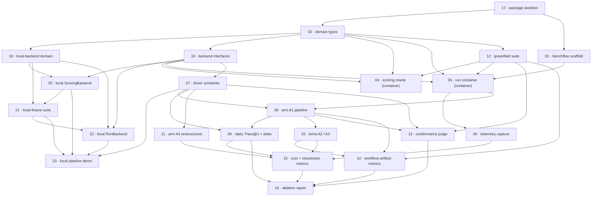

# Plan: spec-workflow benchmark harness

**Status:** Done · **Date:** 2026-05-27 · **Owner:** Ant Stanley · **Source spec:** [docs/benchmark/specs/](../../benchmark/specs/)

Build the benchmark harness described in `docs/benchmark/specs/` — a runner that executes a five-arm ablation matrix (A0–A4) over the greenfield suite and scores candidates against a hidden oracle the workflow's gates never see. The decomposition follows a thin reviewability spine, re-sequenced (2026-05-27) around the merged change spec [`changes/merged/2026-05-27-local_backends.md`](../../benchmark/specs/changes/merged/2026-05-27-local_backends.md) so the first milestone needs no Docker: a **local** milestone (M0) stands up a Python skeleton, the domain types, a pluggable `RunBackend`/`ScoringBackend` seam, Docker-free local backends, and a self-contained `local-fixture` suite, then runs the driver and a minimal aggregation over the fixture for a deterministic, locally-verifiable run→score→aggregate pipeline. The **container** milestone (M1) then adds the BenchFlow substrate, the **greenfield suite**, and the container backends to get the **A0 baseline** scored on greenfield; M2 adds the **A1 pipeline** and the headline A1−A0 ablation table; M3 broadens to the remaining arms (A2/A3/A4); M4 layers on the distinctive metrics — conformance, gate efficacy, cost-matched resolution — and the full report. Numbers are append-only: the local re-plan added tasks 17–23, and a second re-plan (2026-05-27) removed SWE-bench Pro from the canonical spec — dropping task 03 (the SWE-bench Pro suite), moving the greenfield suite (12) into M1 as the sole ablation suite, and re-pointing the container backends (04, 05) at greenfield. Task numbers are ids, not the build order — the order is the Implementation-order line below.

---

## Source and definition-of-done baseline

- **Spec.** [docs/benchmark/specs/](../../benchmark/specs/) — the whole set is in scope: [00-overview](../../benchmark/specs/00-overview.md), [01-domain-model](../../benchmark/specs/01-domain-model.md), [02-arms](../../benchmark/specs/02-arms.md), [03-task-suites](../../benchmark/specs/03-task-suites.md), [04-metrics](../../benchmark/specs/04-metrics.md), [05-harness-architecture](../../benchmark/specs/05-harness-architecture.md), [06-scoring-and-statistics](../../benchmark/specs/06-scoring-and-statistics.md), and [canonical-types.schema.json](../../benchmark/specs/canonical-types.schema.json). The merged change spec [`changes/merged/2026-05-27-local_backends.md`](../../benchmark/specs/changes/merged/2026-05-27-local_backends.md) (pluggable backends + local-fixture suite), which tasks 17–23 implemented, is folded into those pages. **SWE-bench Pro is out of scope:** it was removed from the canonical spec (2026-05-27), so the issue-fixing suite, the `swe-bench-pro` oracle convention, and the prebuilt SWE-bench Pro images are not part of this plan; re-adding them is the pending change spec [`changes/2026-05-27-add_swe_bench_pro_suite.md`](../../benchmark/specs/changes/2026-05-27-add_swe_bench_pro_suite.md), to be planned separately when accepted.
- **Already built.** Greenfield — nothing exists yet. The repo holds only a placeholder `main.py`; no harness, suites, or tests.
- **Definition of done.** A repo-wide [`docs/specs/development-guidelines.md`](../../specs/development-guidelines.md) now formalizes the bar (Clean Code style, Python conventions, jj, definition of done), authored 2026-05-27; ruff + pytest + pyright (standard) are wired into a pre-push hook (`.githooks/pre-push`) and CI (`.github/workflows/ci.yml`), both running `scripts/check.sh`. The per-task bar is derived from that page, repo signals, and the spec's own conventions: Python 3.13 with `uv`-managed, locked dependencies; `pytest` tests including the negative-space case named in each task; `ruff` lint and format clean; every record validates against [canonical-types.schema.json](../../benchmark/specs/canonical-types.schema.json); every limit a named constant; version control via `jj`. Adopting a formal guidelines page is an Open question. Each task file adds its task-specific acceptance on top of this baseline.

---

## Task graph

The dependency table is the **source of truth**; the Mermaid graph visualizes it. If the two disagree, the table wins.

Rows are listed in numeric (id) order for findability; the build sequence is the **Implementation order** line below. Because tasks 17–23 were appended in a re-plan, `Depends on` no longer always references a lower number — numbers are ids, not order. The graph is still acyclic (verified in Phase 5).

| Task | Depends on | Edge kind | Produces (reviewable artifact) |
|---|---|---|---|
| [01 benchflow scaffold](01-benchflow_scaffold.md) | 17 | build | the BenchFlow substrate layered on the skeleton; `bench tasks check` passes |
| [02 domain types](02-domain_types.md) | 17 | build | typed entity records that validate against the canonical schema, round-tripped |
| [04 scoring oracle (container)](04-scoring_oracle.md) | 02, 12, 19 | build, data, contract | the `container` ScoringBackend; resolves a greenfield reference solution, hidden tests off the run side |
| [05 run container (container)](05-run_container.md) | 01, 02, 12, 19 | build, data, contract | the `container` RunBackend; A0 yields a candidate patch + transcript on greenfield |
| [06 telemetry capture](06-telemetry_capture.md) | 05 | build | tokens, cost, wall-clock, and turns recorded into the artifact bundle |
| [07 driver scheduler](07-driver_scheduler.md) | 19 | build | a backend-neutral driver; a campaign yields one score report per trial |
| [08 arm A1 pipeline](08-arm_a1_pipeline.md) | 05, 07 | build, review | A1 drives creator→planner→builder and is scored on greenfield |
| [09 stats: Pass@1 + delta](09-stats_pass1_delta.md) | 07, 08 | build, review | the A0-vs-A1 ablation table with binomial CIs, Pass@k, and a McNemar delta |
| [10 arms A2 / A3](10-arms_a2_a3.md) | 08 | build | A2 (spec given) and A3 (gates off) scored on greenfield |
| [11 arm A4 unstructured](11-arm_a4_unstructured.md) | 07 | build | A4 (budget-matched naive parallel split) scored on greenfield |
| [12 greenfield suite](12-greenfield_suite.md) | 02 | data, build | greenfield instances + two-image build (run image hidden-test-free, scoring image with them); the sole ablation suite |
| [13 conformance judge](13-conformance_judge.md) | 07, 08, 12 | build, data | spec-conformance scores with a stated human-label agreement figure |
| [14 workflow-artifact metrics](14-workflow_artifact_metrics.md) | 08, 10, 12 | build, data | plan coverage, DAG validity, gate catch rate, and false-`Done` escape rate |
| [15 cost + robustness metrics](15-cost_robustness_metrics.md) | 06, 09, 10, 11 | build, data | cost-matched %Resolved, parallel speedup, and the robustness columns |
| [16 ablation report](16-ablation_report.md) | 09, 13, 14, 15 | build, review | the full ablation table — every metric column and all four pairwise deltas |
| [17 package skeleton](17-package_skeleton.md) | — | — | a uv + pytest + ruff Python package tree, no BenchFlow — the Docker-free root |
| [18 local-backend domain](18-local_backend_domain.md) | 02 | build | schema + types carry `local-fixture`, `local`, and `Campaign.backend`/`solver` |
| [19 backend interfaces](19-backend_interfaces.md) | 02 | contract | the `RunBackend` / `ScoringBackend` protocols the driver codes against |
| [20 local ScoringBackend](20-local_scoring_backend.md) | 18, 19 | build, contract | a Docker-free scorer (temp checkout + local pytest) |
| [21 local-fixture suite](21-local_fixture_suite.md) | 18, 20 | data, review | a bundled fixture instance scored by the local backend |
| [22 local RunBackend](22-local_run_backend.md) | 18, 19, 21 | build, contract | a Docker-free runner with a fixture solver that emits the gold patch |
| [23 local pipeline demo](23-local_pipeline_demo.md) | 07, 20, 21, 22 | build, review | the driver runs a local campaign run→score→aggregate, deterministic, no Docker |

The `contract` edge (19 → 04/05/07/20/22) is the backend interface: the driver and every concrete backend depend on the `RunBackend`/`ScoringBackend` protocols.

---

## Implementation order and milestones

**Order:** `17, 02, 18, 19, 07, 20, 21, 22, 23, 01, 12, 04, 05, 06, 08, 09, 10, 11, 13, 14, 15, 16`. The spine is re-sequenced so the **local milestone (M0)** comes first and needs no Docker: the skeleton (17), domain types (02), the backend seam (18, 19), the driver against the interface (07), the local backends and fixture (20, 21, 22), and the local pipeline demo (23). Within M0 the **interface (19)** leads the backends it defines, and the **driver (07)** is built against the interface before its first real exercise in the demo (23). The **container milestone (M1)** then adds BenchFlow (01) and the **greenfield suite (12)** — now the sole ablation suite, so it leads the container backends that provision against it — then the container backends (04, 05) reusing the already-built driver to score **A0** on greenfield; the container `ScoringBackend` (04) still leads its `RunBackend` (05) so the reference-solution sanity check retires the integrity risk early. **Stats (09)** follows A1 (08) so its first output is the headline A1−A0 delta.

**Milestones:**

| Milestone | Tasks | Demonstrable when complete | Review gate |
|---|---|---|---|
| M0 — local pipeline (Docker-free) | 17, 02, 18, 19, 07, 20, 21, 22, 23 | run a local campaign over the `local-fixture` suite with the fixture solver and read a deterministic resolved verdict + %Resolved — the whole run→score→aggregate pipeline, no Docker, BenchFlow, or API | the fixture trial resolves deterministically across re-runs; run dir and scoring dir are separate with hidden tests on the scoring side only; `uv run pytest` + `ruff` clean |
| M1 — container foundations, greenfield suite & A0 | 01, 12, 04, 05, 06 | run A0 on a handful of greenfield instances via the **container** backend and read raw %Resolved; scoring runs in a separate container; telemetry recorded | A0 scored end to end on ≥3 greenfield instances; the reference-solution sanity check resolves in the container oracle; hidden tests confirmed absent from the run container |
| M2 — headline A1−A0 slice | 08, 09 | the A0-vs-A1 ablation table with binomial CIs, Pass@k, and a McNemar delta on greenfield | the table is reproducible across a re-run within its stated intervals |
| M3 — full arm matrix | 10, 11 | all five arms (A0–A4) run over the greenfield suite and are scored | every arm yields score reports on the greenfield instances |
| M4 — distinctive metrics & full report | 13, 14, 15, 16 | the complete ablation table — conformance, gate efficacy, cost-matched resolution, robustness, and all four pairwise deltas | the conformance judge is calibrated to the agreed human-label agreement figure |

The change spec [`changes/merged/2026-05-27-local_backends.md`](../../benchmark/specs/changes/merged/2026-05-27-local_backends.md) has been merged into the canonical pages (spec-creator's merge step), so the canonical set describes the backend seam as shipped.

---

## Build status (spec-builder run, 2026-05-27 → 2026-05-28)

**M0 — DONE and pushed (2026-05-27).** All nine M0 tasks (17, 02, 18, 19, 07, 20, 21, 22, 23) were built each in an isolated jj workspace, gated by a separate agent through semi-formal-review (**CORRECT**) and validate-done-certificate (**DONE**), then merged — one commit per task — onto the `spec-workflow-benchmark` bookmark (pushed to origin, tip `82999933` at M0 close). Final M0 state: **66 tests pass**, `ruff check` + `ruff format --check` clean, and `uv run python -m benchmark.harness.run_local_demo` runs the full run→score→aggregate pipeline deterministically (%Resolved 1.0 fixture / 0.0 no-op, no Docker/BenchFlow/API).

**M1–M4 — DONE and pushed (2026-05-27 / 2026-05-28).** All 13 remaining tasks (01, 12, 04, 05, 06, 08, 09, 10, 11, 13, 14, 15, 16) were built each in an isolated jj workspace, gated by a separate agent through semi-formal-review (**CORRECT**) and validate-done-certificate (**DONE**), and merged one commit per task onto the `spec-workflow-benchmark` bookmark (final tip `89fd1a82`). **262 tests pass** on the integration tip + 5 opt-in `BENCHMARK_RUN_*_LIVE` tests that skip on CI; ruff + pyright clean; every certificate is discharged `Validated`. Live arm runs on the `text_toolkit` greenfield seed (n=1; full sizing remains an open question): A0 ~$0.15 partial, A1 ~$0.96 resolved=false (single-prompt under-built 1/4 tasks — recorded Open question), A2 $4.18 resolved=true with 4 GateEvents, A3 $1.60 resolved=true with 0 GateEvents (gates are the ONLY A2/A3 difference), A4 $0.65 resolved=true with 3 merge conflicts recorded. Total live spend ≈ $7.5. The live gate-probe ran one injected `off-by-one` defect → CAUGHT by `semi-formal-review`. Conformance live judgment on A2's patch → 0.97; calibration exact-bucket agreement 0.80, Cohen's κ 0.64 (clears the documented 0.75 bar). The cost-matching basis is pinned to **dollars** (selectable via `CostBasis`); the four pairwise deltas use **Holm-Bonferroni at α=0.05**. Two Open questions were carried over and threaded through: GateEvents now ride on `TrialResult.gate_events` (driver reads `last_gate_events` off the backend in task 14); single-prompt A1 under-builds remains a campaign-tuning open question for the headline A1−A0 delta. Environment unblockers landed 2026-05-27 (Docker daemon up + non-sudo; OAuth-credentials mount path validated; the `~/.claude/plugins/marketplaces/skills/plugins` layout for `--plugin-dir`); a session-limit interruption mid task 08 was resolved by `/login` + resume. The harness is reportable end to end: a campaign over the greenfield suite yields a full ablation table (every metric column for A0–A4 plus the four McNemar-tested pairwise-delta rows with Holm-adjusted p-values).

**Re-planned 2026-05-27 (SWE-bench Pro removed).** After M0 shipped, SWE-bench Pro was removed from the canonical spec; this plan was re-cut to match — task 03 (SWE-bench Pro suite) and its certificate were deleted, the greenfield suite (12) moved into M1 as the sole ablation suite, and the container backends (04, 05) re-pointed at greenfield (the gold-patch sanity check became a greenfield private-reference-solution check). No M0 work was disturbed. Re-adding SWE-bench Pro is a separate pending change spec, to be re-planned if accepted.

**Pending (deferred, the user's to run):**
- A spec-conformance pass (spec-reviewer R2/R3) over the integrated M0–M4 code vs. the source spec — outside the per-task gates (per spec-builder's Phase 5).
- A power-analyzed campaign — the seed authored two greenfield instances; the real ablation table needs a larger seed (still the binding constraint on whether the arms separate) and `trialsPerInstance` tuned for informative paired intervals.
- A campaign-tuning pass for A1 orchestration depth, so single-prompt A1 walks the entire plan DAG rather than ending its turn after ~1 task. Bears on the A1−A0 headline delta.

---

## Assumptions and open questions

**Assumptions**

- The spec is settled enough to sequence; its open questions refine *values* (suite sizes, thresholds, cost basis), not the *structure* the graph depends on.
- The BenchFlow `bench` SDK can host this benchmark's `TaskInstance` schema, per-arm provisioning, and a two-container run/scoring split without being forked. Task 01 surfaces this early if it cannot. **Investigated 2026-05-27 (`benchflow==0.4.0`): partially false — `bench tasks init`/`check` exist and work, but the eval model is a single sandbox (agent + verifier share one environment) and `check` validates a fixed task layout, not a custom schema. The two-container split and the `TaskInstance` schema stay on the benchmark's own backend seam; see the resolved Open question below and `benchmark/harness/substrate.py`.**
- The `spec-*` plugins run non-interactively inside a container with recoverable token/cost/wall-clock/turn telemetry, for the plain A0 baseline as well as the plugin arms.
- A jj-or-git colocated repo is available in each run container; `spec-builder` selects the backend itself.
- Reviewers sign off per milestone, so each milestone boundary is a real gate.

**Decisions**

- *Thin A0→A1 spine before breadth.* **A0 path (M1) then A1 delta (M2) before any other arm.** It makes the headline result demonstrable earliest and proves the container run→score→aggregate pipeline with the plain baseline before the heavy workflow arm is built.
- *Greenfield is the sole ablation suite.* **SWE-bench Pro removed from the canonical spec (2026-05-27).** The benchmark now runs the A0–A4 matrix on the authored greenfield suite only; the issue-fixing suite, the `swe-bench-pro` oracle convention, and the prebuilt images are deferred to a separate change spec, so task 03 was dropped and greenfield (12) became the M1 foundation that A0 is first scored on.
- *Score the oracle before the runner exists.* **04 before 05, reviewed via a greenfield reference solution.** The run/scoring isolation rule is the spec's integrity backbone; greenfield carries no arms-visible `goldPatch`, so a private reference solution shipped with a self-test instance (task 12) plays the gold patch's role — feeding it resolves, a no-op does not — retiring the integrity risk while nothing depends on the oracle yet.
- *Five arms split across three tasks by shared machinery.* **A1 alone (08); A2/A3 as config variants together (10); A4 alone (11).** A2 and A3 are flag-level changes to A1's pipeline; A4 is a different orchestration (naive split, no plugins) and stands on its own.
- *Greenfield suite is one package and an M1 foundation.* **Two-image mechanics, a seed set of instances, and a private reference solution (12).** The run/scoring image split, the instances that prove it, and the self-test patch are one reviewable vertical slice; as the only suite, it now precedes the container backends that score against it. Full suite sizing is deferred.
- *Re-planned for a Docker-free first milestone.* **M0 builds a local backend + fixture before any container work.** The original M1 could not be built or validated without Docker, BenchFlow, and an API budget; the [merged change spec](../../benchmark/specs/changes/merged/2026-05-27-local_backends.md) adds a backend seam so the whole pipeline is verifiable locally first, de-risking the design before the infrastructure-heavy tasks.
- *Numbers are ids, not order, across both re-plans.* **Tasks 17–23 appended (local re-plan); task 03 deleted and 04/05/12 edges re-pointed (SWE-bench Pro re-plan); nothing renumbered.** Renumbering would break every cross-reference; the build order lives in the Implementation-order line, and the graph is kept acyclic. A deleted id (03) is left retired rather than backfilled.
- *The driver depends on the interface, not on concrete backends.* **07 depends on 19; 04/05 (container) and 20/22 (local) implement it.** This is what lets one driver run over either backend and what makes a Docker-free M0 reach the driver at all.

**Open questions**

- *Two-container split in BenchFlow's eval model.* Whether the two-container run/scoring split is expressible within BenchFlow's eval model or needs a thin wrapper. **Resolved 2026-05-27 (Task 01, `benchflow==0.4.0`) — it needs a wrapper.** Findings, with evidence from the installed package: (1) `bench tasks init` / `bench tasks check` DO exist and work — a trivial task scaffolded with `bench tasks init` passes `bench tasks check` with no Docker daemon (`check` is a pure structural validator; in-repo probe at `benchmark/suites/benchflow-probe/trivial-probe`). (2) `bench eval create` runs a **single-sandbox rollout**: the agent runs in the task's one environment (`--sandbox docker|daytona|modal`), then the verifier (`tests/test.sh` → reward) runs in that **same** environment — BenchFlow does NOT natively stand up a second, clean scoring container with hidden tests injected only there, so the spec's §Scoring-isolation two-container rule is NOT expressible by the stock eval model alone. (3) `bench tasks check` validates a **fixed** layout (`task.toml` + `instruction.md` + `environment/`, optional `tests/`+`solution/`), not this benchmark's `TaskInstance` schema. **Decision:** keep the benchmark's own `RunBackend`/`ScoringBackend` seam (`benchmark.harness.backends`, built in M0) as the substrate for the two-container split and the custom schema; use BenchFlow as a complementary layer for task authoring/validation and ACP-agent rollouts where it fits. Recorded in `benchmark/harness/substrate.py` with a test (`benchmark/tests/test_substrate.py`) asserting the wired pieces. `benchflow` is uv-locked.
- *Development-guidelines page.* ~~Should a formal guidelines page be authored so the bar is explicit and shared?~~ **Resolved 2026-05-27** — [`docs/specs/development-guidelines.md`](../../specs/development-guidelines.md) authored in Clean Code style for Python. Its own Open questions track the still-unwired enforcement (pre-push hook, CI, strict type checker).
- *Greenfield suite size and trial counts.* How many greenfield instances and `trialsPerInstance` give informative paired intervals? Early milestones use a small seed (≈5 instances, ≥3 trials); full sizing waits on a power analysis ([03-task-suites.md](../../benchmark/specs/03-task-suites.md), [06-scoring-and-statistics.md](../../benchmark/specs/06-scoring-and-statistics.md)). With SWE-bench Pro removed, greenfield carries the whole comparison, so its size is the binding constraint on whether the arms separate.
- *Container–local verdict parity.* Does the container `ScoringBackend` (task 04) agree with the already-built `local` backend on the same patch — a shared conformance test, or accepted as backend-specific? Carried over from the local_backends change spec; matters more now that greenfield self-test instances stand in for SWE-bench Pro's gold patches.
- *Cost-matching basis.* Tokens, dollars, or wall-clock? The choice sets the headline of task 15 ([04-metrics.md](../../benchmark/specs/04-metrics.md)) and must be fixed before that delta is reported.
- *Conformance judge calibration.* The human-label agreement threshold and sample size that make the conformance score reportable — task 13's gate ([06-scoring-and-statistics.md](../../benchmark/specs/06-scoring-and-statistics.md)).
- *Given-spec provenance for A2/A3.* Whether the handed-in spec is authored by `spec-creator` separately, by a human, or from the greenfield materials — it changes what A1−A2 means and what task 10 implements ([02-arms.md](../../benchmark/specs/02-arms.md)).
- *A4 decomposition policy.* What counts as a fair "naive split" (fixed partition vs a single "split N ways" prompt) — task 11 must pin it to be reproducible ([02-arms.md](../../benchmark/specs/02-arms.md)).
- *Per-task escape attribution.* Whether hidden tests can be tagged to spec sections (`testTags`) reliably enough for per-task false-`Done` rates, or whether task 14 falls back to instance granularity ([06-scoring-and-statistics.md](../../benchmark/specs/06-scoring-and-statistics.md)).
- *Planning not independently isolated.* No pair isolates `spec-planner`; a sixth arm would change the closed set ([02-arms.md](../../benchmark/specs/02-arms.md)). Does not block the build; flagged for the arm-set decision.
