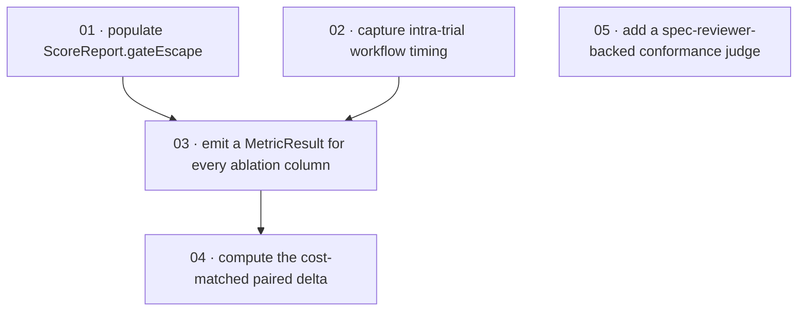

# Plan: close the Group A spec-vs-code gaps

**Status:** Draft · **Date:** 2026-05-28 · **Owner:** Ant Stanley · **Source spec:** [docs/benchmark/specs/](../../benchmark/specs/) (Group A findings from the R2 conformance review)

Close the five Group A divergences my R2 spec-conformance review surfaced — cases where the existing canonical benchmark spec asserts a feature the integrated code under `benchmark/` does not honor. Each gap is small in isolation; together they form a focused tidy-up on the scoring and stats layer, with one independent task on the conformance judge. The reviewability spine builds the foundation first (populate the `ScoreReport.gateEscape` field the spec promises; capture intra-trial timing so parallel speedup means what the spec says it means), then layers the universal `MetricResult` emission and the cost-matched paired delta on top of those clean inputs, while the spec-reviewer-backed conformance-judge alternative runs on its own track and can land any time.

---

## Source and definition-of-done baseline

- **Spec.** The R2 review consolidated under [`docs/plans/2026-05-27-spec_workflow_benchmark/plan.md`](../2026-05-27-spec_workflow_benchmark/plan.md) catalogued five spec-claims-without-code on [`docs/benchmark/specs/04-metrics.md`](../../benchmark/specs/04-metrics.md) and [`docs/benchmark/specs/06-scoring-and-statistics.md`](../../benchmark/specs/06-scoring-and-statistics.md). Each task file below names the exact spec section it satisfies. A sixth gap (`instances.jsonl` claimed on [`03-task-suites.md`](../../benchmark/specs/03-task-suites.md) §Implementation layout) is **out of scope** here — see Decisions.
- **Already built.** The full M0–M4 harness ships on the `spec-workflow-benchmark` bookmark (origin tip `1fa78d42`). Every entity, backend, arm, suite, scoring path, probe, statistic, and the ablation report exist; the Group A tasks below are *modifications* and *additions* to that built surface. The shared resolution rule (`benchmark/harness/scoring/resolution.py`), the Wilson CI and McNemar primitives (`benchmark/harness/stats/outcome.py`), `cost_matched_resolved_for_arm` and `parallel_speedup_for_arm` (`benchmark/harness/stats/cost_robustness.py`), the `_with_conformance` pattern (`benchmark/harness/scoring/conformance/judge.py`), and the `_run_workflow_arm` path (`benchmark/harness/backends/container.py`) are all in place to be extended.
- **Definition of done.** [`docs/specs/development-guidelines.md`](../../specs/development-guidelines.md) §Definition of done is the inherited bar for every task: `scripts/check.sh` passes (`uv run ruff format --check` + `uv run ruff check` + `uv run pyright` + `uv run pytest`), new validation paths have negative-space tests (FIRST), no duplicated logic was introduced, magic numbers are named constants, errors are raised with context, and if domain types changed `canonical-types.schema.json` is updated and every record still validates. Each task file adds only its task-specific acceptance on top of this baseline.

---

## Task graph

The dependency table is the **source of truth**; the Mermaid graph visualizes it. If the two disagree, the table wins.

| Task | Depends on | Edge kind | Produces (reviewable artifact) |
|---|---|---|---|
| [01 populate ScoreReport.gateEscape](01-populate_score_report_gate_escape.md) | — | — | every gated trial's `ScoreReport.gateEscape` is set by the scoring pipeline (not reconstructed downstream), and a test asserts the field matches `not resolved` on gated arms and is `None` on A0/A4 |
| [02 capture intra-trial workflow timing](02-capture_intra_trial_workflow_timing.md) | — | — | `_run_workflow_arm` records per-task wall-clocks into the `ArtifactBundle`, and `parallel_speedup_for_arm` reads them to produce the speedup the spec defines (sum of per-task wall-clocks ÷ orchestrator wall-clock) |
| [03 emit a MetricResult for every ablation column](03-emit_metric_result_for_every_ablation_column.md) | 01, 02 | data, review | a single emitter returns the full sixteen `MetricResult` records for an (Arm, Suite), honoring the [`04-metrics.md`](../../benchmark/specs/04-metrics.md) §Implementation layout claim, and a test asserts every ablation-table column appears as a schema-valid `MetricResult` |
| [04 compute the cost-matched paired delta](04-compute_cost_matched_paired_delta.md) | 03 | build | the four pairwise comparisons (A1−A0, A1−A2, A2−A3, A1−A4) each produce a cost-matched McNemar delta alongside the raw delta, surfaced in the ablation table and in the emitted `MetricResult`s |
| [05 add a spec-reviewer-backed conformance judge](05-add_spec_reviewer_conformance_judge.md) | — | — | a new `JudgeCallable` invokes `spec-creator:spec-reviewer` R2 on captured `specArtifacts`, returns a `[0,1]` score plus rationale, is selectable per campaign, and is bounded by a named `--max-budget-usd` cap |

Every `Depends on` references a **lower** task number — the property that numbering in implementation order guarantees. Edge kind names why: `data` = the dependent task reads a field the dependency populates (01 → 03 on `gateEscape`; 02 → 03 on per-task wall-clocks); `review` = the dependent task can only be honestly reviewed once the dependency works (03's universal MetricResult claim is only meaningful once gateEscape is populated and speedup is honest); `build` = the dependent task's code reuses the dependency's emitter machinery (03's per-arm MetricResult helpers slot the cost-matched deltas straight in).

---

## Implementation order and milestones

**Order:** `01, 02, 03, 04, 05`. The spine retires the spec-claims-without-code first (`01` populates a field the spec says is recorded; `02` makes the spec's parallel-speedup definition computable), then layers the universal `MetricResult` emission (`03`) and the cost-matched paired delta (`04`) on top of those clean inputs. Task `05` (the spec-reviewer-backed conformance judge) is independent of the spine and can land in parallel with `01`–`04` — its number reflects landing order rather than a dependency on the prior four.

**Milestones:**

| Milestone | Tasks | Demonstrable when complete | Review gate |
|---|---|---|---|
| M1 — scoring-and-stats spec-claim closure | 01, 02, 03, 04 | re-running `build_ablation_report` on the saved live-arm evidence (`benchmark/tests/_a*_live_evidence/`) shows: `ScoreReport.gateEscape` populated on every gated trial; `parallel_speedup` computed against per-task intra-trial wall-clocks; every ablation column emitted as a schema-valid `MetricResult`; four cost-matched McNemar delta rows alongside the raw deltas | `scripts/check.sh` green; the ablation-report Markdown shows the four new cost-matched delta lines; a test loads the saved evidence and asserts each new `MetricResult` matches the corresponding `ArmRow` cell to a tolerance |
| M2 — conformance judge alternative procedure | 05 | a `Campaign` configured with `conformance_judge = "spec-reviewer"` runs the live conformance test through the new `JudgeCallable` and returns a `[0,1]` score with rationale, bounded by the budget cap | `scripts/check.sh` green; saved live evidence for the spec-reviewer-backed judgment under `benchmark/tests/_conformance_live_evidence/` (mirroring the rubric-direct path's saved evidence) |

---

## Assumptions and open questions

**Assumptions**

- The spec's parallel-speedup definition ("A1's wall-clock vs the same plan run sequentially") is read as *sum of per-task wall-clocks over the same trial divided by the orchestrator's wall-clock for that trial*. Task `02` makes that quantity computable by capturing per-task wall-clocks at orchestration time; if a reviewer reads the spec differently (e.g. as a separate sequential A1 run on the same plan), task `02`'s scope grows substantially. Flagged in the task file's Open questions.
- The spec-reviewer plugin (`~/.claude/plugins/marketplaces/skills/plugins/spec-creator/skills/spec-reviewer`) stays installed and reachable from the host where conformance scoring runs; task `05` relies on its R2 mode being invocable as a subprocess.
- The two companion change specs ([`2026-05-28-promote_built_state_and_resolved_decisions.md`](../../benchmark/specs/changes/2026-05-28-promote_built_state_and_resolved_decisions.md) and [`2026-05-28-document_shipped_surfaces.md`](../../benchmark/specs/changes/2026-05-28-document_shipped_surfaces.md)) are landing on the same branch; this plan does not block on them, but their merge changes the canonical pages each task's `Implements:` line references.

**Decisions**

- *Five tasks, not six — `instances.jsonl` is a spec edit, not a code edit.* **Out of scope here.** [`03-task-suites.md`](../../benchmark/specs/03-task-suites.md) §Implementation layout shows an `instances.jsonl` file that does not exist; the actual on-disk shape is in-Python `INSTANCE_SPECS` plus the per-instance asset trees. For a few hand-authored instances the in-Python authoring is the better dev experience (multi-line prose `problemStatement`, list-of-tag tuples, optional `reference/solution.patch`) and the JSONL shape would be a maintenance step backward. The companion change spec [`2026-05-28-promote_built_state_and_resolved_decisions.md`](../../benchmark/specs/changes/2026-05-28-promote_built_state_and_resolved_decisions.md) rewrites the §Implementation layout block to reflect the in-Python authoring; once it merges, the divergence closes without code work here.
- *`_with_escape` is a one-shot driver-side mutation, not a backend-side step.* **The driver populates `ScoreReport.gateEscape` after scoring, gated on `Arm.gatesEnabled`, mirroring `_with_conformance`.** The scoring backends are arm-agnostic by design (the resolution rule does not know whether the arm ran gates); placing the call on the backend would force every backend to learn arm-awareness. The driver already knows the arm, already knows the gated set, and is the natural site for a post-score field population.
- *Reviewability over dependency-only sort puts `01` ahead of `02`.* **The smaller, scope-stable closure leads.** `01` and `02` have no edges between them; either could come first by dependency. `01` is one short field population plus its test; `02` reshapes telemetry capture inside `_run_workflow_arm`. Leading with `01` clears the smaller debt fast, lets a reviewer sign off on the gateEscape claim independently, and means `03`'s reverse pass over the ablation columns sees a populated `gateEscape` from day one.
- *Cost-matched delta and universal MetricResult emission are two tasks, not one.* **They share machinery but the surfaces a reviewer signs off on are different.** `03` is "every column is a `MetricResult`" — a coverage claim; `04` is "the cost-matched comparison has a delta row, not just a column" — a behaviour claim. Reviewing them together would conflate the two; splitting keeps each DoD checkable on its own evidence.
- *No done certificates authored.* **Skipped at the user's request (this plan is a focused tidy-up; the per-task DoD lines are sufficient on their own).** A later pass can author certificates by running `spec-planner:done-certificates` over this folder; the present plan does not block on them. The Phase 5 Done-certificates cross-link check is therefore not applicable here.

**Open questions**

- *Per-task wall-clock capture mechanism.* The cleanest place to record a per-task wall-clock inside `_run_workflow_arm` depends on what the spec-builder skill surfaces in its captured certificates and transcript. The first probe is whether each task's discharged certificate (already parsed by `extract_gate_events`) carries an elapsed-seconds line; if not, the workflow prompt itself names where to write the per-task wall-clock as a side artifact. Task `02` resolves which.
- *Where the cost-matched paired delta lives in the ablation report's Markdown.* Two surfaces are plausible: a fifth section of pairwise-delta bullets ("cost-matched deltas") below the existing four, or an extra metric attached to each existing delta row. Task `04` picks; the choice does not change the emitted `MetricResult`s.
- *Selecting the conformance judge per campaign.* Whether `conformance_judge` belongs on `Campaign` as a new field (schema delta) or on a `JudgeOptions` runtime parameter the driver injects. Task `05` resolves; the lighter touch is the runtime parameter, but a `Campaign` field is more reproducible across re-runs.
