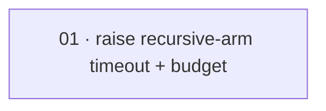

# Plan: Raise the recursive-arm workflow timeout and budget

**Status:** Proposed · **Date:** 2026-05-28 · **Owner:** Ant Stanley · **Source spec:** [changes/2026-05-28-raise_recursive_arm_timeout_budget.md](../../benchmark/specs/changes/2026-05-28-raise_recursive_arm_timeout_budget.md)

> Single-task plan: move two named constants and let the existing A2/A3/A4 budget derivations track the raised value. No domain, schema, arm, or metric change.

Raise the recursive-workflow run timeout (A1/A2/A3) from 1200 s to **3600 s** and the paired per-run budget cap from `$20` to **`$60`** (3× the time → 3× the dollars), so a real recursive `spec-planner`+`spec-builder` build inside the run container has room to finish instead of being SIGKILLed mid-build (the live container witness's gate-emission step hit the 20-minute `subprocess` bound on arm A2). The plain-agent (A0) and naive-parallel (A4) per-agent timeouts are a *distinct* constant and stay at the 20-minute ceiling; the A2/A3 budget cap and A4's total/per-agent caps are *derived* from `A1_MAX_BUDGET_USD` and track the new value with no derivation change. The work is one reviewable slice — two constant edits plus the tests that lock the new values and the no-regression of the plain-agent path.

---

## Source and definition-of-done baseline

- **Spec.** [changes/2026-05-28-raise_recursive_arm_timeout_budget.md](../../benchmark/specs/changes/2026-05-28-raise_recursive_arm_timeout_budget.md) — the whole change spec is in scope; its `Proposed changes` target [02-arms.md](../../benchmark/specs/02-arms.md) (§Decisions — the A4-budget Decision's referenced value) and [05-harness-architecture.md](../../benchmark/specs/05-harness-architecture.md) (§Concurrency and reproducibility, §Runtime verification — the recursive-workflow run timeout). The schema sidecar is unchanged. The canonical prose is applied at *merge* (after this plan is built, by the integrating orchestrator — a parallel job also edits `02`), so the task points at the change spec's sections, not yet-merged canonical headings.
- **Already built (preconditions, not tasks).** The recursive-workflow run path `ContainerRunBackend._run_workflow` (`benchmark/harness/backends/container.py`) and its keepalive in `_start_container`, both reading `A1_RUN_TIMEOUT_SECONDS` by name; the per-run budget cap `A1_MAX_BUDGET_USD` (`benchmark/harness/arms/a1.py:88`) and its derivations `A2_A3_MAX_BUDGET_USD` (`a2_a3.py:175`), `A4_TOTAL_MAX_BUDGET_USD` (`a4.py:115`), `A4_PER_AGENT_MAX_BUDGET_USD = A4_TOTAL_MAX_BUDGET_USD / A4_N` (`a4.py:120`); the plain-agent / A4 timeout `AGENT_RUN_TIMEOUT_SECONDS` / `A4_AGENT_RUN_TIMEOUT_SECONDS` (the distinct constant that must NOT move). This plan only changes two scalar values and the tests/prose that pin them.
- **Definition of done.** Inherited from [`docs/specs/development-guidelines.md`](../../specs/development-guidelines.md) §Testing, §Limits and bounds, §Python conventions: Python 3.13 under `uv`; `ruff` lint+format clean (`E,F,I,UP,B`); `pyright` standard clean; `pytest` green via `uv run pytest benchmark/tests -q`; **every limit (timeout, budget cap) a named `SCREAMING_SNAKE_CASE` constant** — the derived budgets stay derivations, not hardcoded numbers; positive **and** negative space (here: positive = the raised values are asserted; negative = the plain-agent/A4 timeout is asserted *unchanged*, so the raise cannot inflate the wrong path). The task adds its task-specific acceptance on top.

---

## Task graph

The dependency table is the **source of truth**; the Mermaid graph visualizes it.

| Task | Depends on | Edge kind | Produces (reviewable artifact) |
|---|---|---|---|
| 01 raise recursive-arm timeout + budget | — | — | `A1_RUN_TIMEOUT_SECONDS == 3600` (container.py) and `A1_MAX_BUDGET_USD == 60.0` (a1.py), with `A2_A3_MAX_BUDGET_USD` / `A4_TOTAL_MAX_BUDGET_USD` tracking `$60` and `A4_PER_AGENT_MAX_BUDGET_USD` recomputing to `$15`; tests assert the new values **and** that `AGENT_RUN_TIMEOUT_SECONDS` stays `1200`; full validation gate green |

### Task 01 — definition of done

- `A1_RUN_TIMEOUT_SECONDS` in `benchmark/harness/backends/container.py` is `3600` (was `1200`); its docstring states it governs the A1/A2/A3 recursive-workflow run only and was raised after the live witness SIGKILL. Its two readers — `_run_workflow`'s `subprocess` timeout and `_start_container`'s workflow-arm keepalive `sleep` — pick up the new value (verified by reading: both reference the constant by name, no literal).
- `A1_MAX_BUDGET_USD` in `benchmark/harness/arms/a1.py` is `60.0` (was `20.0`); `A2_A3_MAX_BUDGET_USD == 60.0`, `A4_TOTAL_MAX_BUDGET_USD == 60.0`, `A4_PER_AGENT_MAX_BUDGET_USD == 15.0` — all by the *unchanged* derivations (no hardcoded derived numbers).
- `AGENT_RUN_TIMEOUT_SECONDS` (and its A4 reuse `A4_AGENT_RUN_TIMEOUT_SECONDS`), `AUTH_PROBE_*`, `SETUP_*`, and `A1_FEASIBILITY_PROBE_TIMEOUT_SECONDS` are **unchanged** — the plain-agent / A4-naive / probe / setup paths are not inflated.
- Tests updated/added: a non-gated test asserts `A1_RUN_TIMEOUT_SECONDS == 3600`; a regression test asserts `AGENT_RUN_TIMEOUT_SECONDS == 1200` and `A1_RUN_TIMEOUT_SECONDS > AGENT_RUN_TIMEOUT_SECONDS`; a test asserts `A1_MAX_BUDGET_USD == 60.0`; the A4 budget test asserts the recomputed `$60` total / `$15` per-agent. `grep -rn "1200\|20.0\|A1_MAX_BUDGET_USD\|RUN_TIMEOUT_SECONDS" benchmark/tests` shows no stale assertion of the old values.
- Validation gate green: `uv run ruff format` (changed `.py`) clean, `uv run ruff check benchmark` clean, `uv run pyright benchmark/harness` clean, `uv run pytest benchmark/tests -q` green (expected 332 passed, 7 skipped, ± the added test assertions).

---

## Implementation order and milestones

**Order:** `01` (single task). It is self-contained: the two constant edits and the tests that lock them ship together so the change is reviewable as one diff.

**Milestones:**

| Milestone | Tasks | Demonstrable when complete | Review gate |
|---|---|---|---|
| M1 — raised rails, regression-guarded | 01 | The recursive-workflow run timeout is 60 min and the per-run budget `$60` (A2/A3/A4 caps track it; A4 per-agent `$15`), while the plain-agent/A4 timeout still reads 20 min | 01 DoD met; `uv run pytest benchmark/tests -q` green with the new and the no-regression assertions |

---

## Assumptions and open questions

**Assumptions**

- The recursive-workflow run path reads `A1_RUN_TIMEOUT_SECONDS` and the budget caps read `A1_MAX_BUDGET_USD` *by name* (confirmed by reading `container.py` / `a2_a3.py` / `a4.py`), so moving the constant values propagates to every call site and derivation without further edits.
- 60 minutes / `$60` is sufficient headroom for a real recursive build on the seed; if a live run still cannot finish, the rails are raised again the same way (carried from the change spec).

**Decisions**

- *One task, not several.* **The two constant edits and their tests are one reviewable slice.** There is no dependency to sequence and no sub-structure worth splitting; a single gated task keeps the change atomic.
- *Certificate derived from the DoD.* **No separate done-certificate file is authored.** The task's `Definition of done` checklist is explicit; the build's `validate-done-certificate` gate derives its obligations from it.
- *Leave the historical A4 live-evidence summary as-is.* **`benchmark/tests/_a4_live_evidence/run_summary.json` keeps its recorded `$20`/`$5` past-run figures.** It is an output artifact of a real run, not a code constant or a test assertion; rewriting it would falsify the record. A future live run regenerates it at the new caps. (Carried from the change spec's implementation notes.)

**Open questions**

- *Live re-run.* Should the gate-emission live container witness (arm A2) be re-run under the new 60-min / `$60` rails to confirm the recursive build completes, before the change spec is marked `Merged`? The build verifies the constants statically; only a live run proves the SIGKILL is gone. Carried from the change spec.
