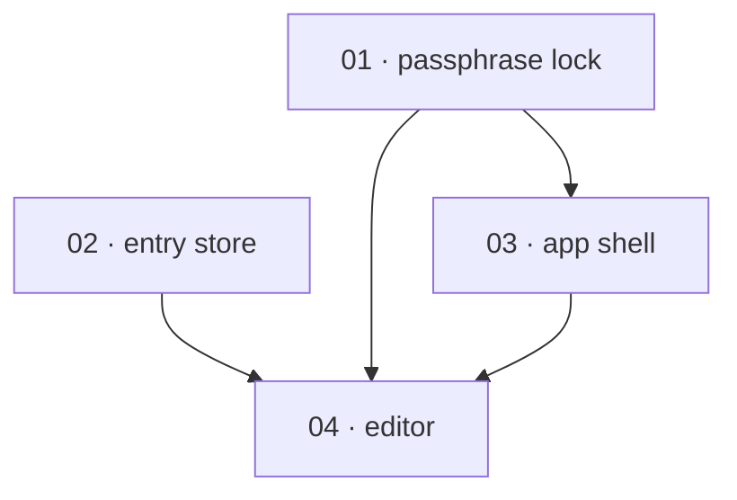

# Plan templates

A plan is a **folder**, not a single file. Repo-wide plans live under the top-level `.specs/plans/`; a plan that targets one package lives under `.specs/<package>/plans/` by default (or a co-located `<package-location>/.specs/plans/`), where `<package>` is the app/package/workspace name. The folder is named `YYYY-MM-DD-snake_case_title/` — an ISO date prefix (the date drafted) then a lowercase snake_case short title, e.g. `.specs/plans/2026-05-22-add_auth_flow/`. `plan.md` sits at its root; the task packages live in four status subfolders that double as a kanban board:

```
.specs/plans/2026-05-22-add_auth_flow/
├── plan.md                       ← overview: graph, order, closing block (stays at root)
├── backlog/                      ← not started
│   ├── 01-passphrase_lock.md
│   ├── 01-passphrase_lock-certificate.md
│   └── 02-entry_store.md
├── in-progress/                  ← being built
│   └── 03-app_shell.md
├── blocked/                      ← parked on a failed gate (blocks dependents)
└── done/                         ← merged, both gates passed
    └── 04-editor.md
```

A task's **status is the subfolder it sits in** — there is no per-task `Status` field. A new plan has **every task in `backlog/`** and nothing elsewhere: spec-planner creates `backlog/` and authors every task (and its certificate) into it, and spec-builder lazily creates `in-progress/`, `blocked/`, and `done/` as the first task moves into each. (git/jj do not track empty directories, so the three are not pre-created.)

There are two skeletons below — one for `plan.md`, one for a task file. Read both before Phase 4 and adapt each to the spec rather than pasting it verbatim.

The task **number** `NN` is the task's identity everywhere in the plan (the dependency table, the Mermaid nodes, every cross-reference, the certificate name) and is assigned in **implementation order**. A task keeps its `NN` as it moves between subfolders, so the number — not the file's location — is what every reference resolves to; within a subfolder, files sort by `NN`. Numbers are **append-only** once the plan is shared: a task added later takes the next free number and records its real position in the order table, rather than renumbering and breaking cross-references.

---

## Status lifecycle

There are two axes of status. The **plan** carries its own `Status` in `plan.md`'s header. A **task**'s status is the subfolder it sits in — there is no per-task `Status` field; the folder *is* the board.

| `plan.md` Status | Meaning |
|---|---|
| `Draft` | Drafted, awaiting agreement on the decomposition and order. Default for a new plan. |
| `Accepted` | Agreed; ready to execute. |
| `In progress` | Execution started; some tasks have left `backlog/`. |
| `Done` | Every task is in `done/` and its definition of done met. Terminal. |

spec-builder **recomputes** `plan.md`'s `Status` from the subfolders after each transition (`In progress` once any task has left `backlog/`, `Done` once every task is in `done/`) — it is the only field the builder writes back to `plan.md`. The planner authors a new plan as `Draft`.

| Task subfolder | Meaning |
|---|---|
| `backlog/` | Not started (Todo). Every task in a freshly authored plan. |
| `in-progress/` | Being implemented. |
| `blocked/` | Parked on a failed gate past its retry bound — gains a `**Blocked:** <reason>` header line and blocks its dependents. |
| `done/` | Merged; both gates passed. |

A task moves `backlog/` → `in-progress/` → `done/`, or to `blocked/` when a gate parks it; spec-builder performs the move on the main tree, and the task keeps its `NN` throughout.

An abandoned plan is deleted, not kept as `Abandoned`; the version-control history records it existed.

---

## `plan.md` skeleton

```markdown
# Plan: <Human-readable title>

**Status:** Draft · **Layout:** kanban · **Date:** YYYY-MM-DD · **Owner:** <Name> · **Source spec:** <path or name>

<One-paragraph summary: what gets built, the shape of the decomposition, and the
reviewability spine (what is built first and why). A reader should know the plan's
shape from this paragraph alone.>

---

## Source and definition-of-done baseline

- **Spec.** <Where the source spec lives and what is in scope — link the canonical
  pages or the change spec, or name the external document.>
- **Already built.** <What the code already provides that this plan treats as a
  precondition, not a task. Cite the spec-reviewer pass or the code read that
  established it, or "(Greenfield — nothing exists yet.)">
- **Definition of done.** <Where each task's DoD comes from — normally
  `.specs/development-guidelines.md` §Definition of done and §Limits and bounds.
  If derived from repo signals or agreed with the user, say so. This baseline is
  inherited by every task; task files add only task-specific acceptance on top.>

---

## Task graph



The dependency table is the **source of truth**; the Mermaid graph visualizes it.
If the two ever disagree, the table wins — fix the graph to match.

| Task | Depends on | Edge kind | Produces (reviewable artifact) |
|---|---|---|---|
| 01 · passphrase lock | — | — | a reviewer can unlock the app |
| 02 · entry store | — | — | entries persist across reloads |
| 03 · app shell | 01 | review | the shell renders behind the lock |
| 04 · editor | 01, 02, 03 | build, data, review | a user can write and save an entry |

Each row keys a task by its **number and title** (`01 · passphrase lock`), **not** a
path hyperlink — a task file moves between subfolders as it is built, so a reader or
tool finds it by globbing its number across the four subfolders (`*/01-*.md`). Keying
by number keeps `plan.md` stable: it is never rewritten when a task moves. `Depends on`
references **lower** task numbers — a property of numbering in implementation order; if
a row depends on a higher number, either the order or the dependency is wrong. Edge
kind names why the dependency exists — build / data / contract / review (see
task-decomposition.md).

---

## Implementation order and milestones

**Order:** `01, 02, 03, 04` — <one or two sentences on the reviewability rationale:
which enablers lead and why. Numbering already follows this order; call out where
the spine departs from a naive dependency-only sort, e.g. why the lock leads even
though the store has no dependencies.>

**Milestones:**

| Milestone | Tasks | Demonstrable when complete | Review gate |
|---|---|---|---|
| M1 — foundations | 01, 02, 03 | a reviewer can unlock the app and see an empty shell backed by a working store | <what must pass before M2> |
| M2 — core path | 04 | write an entry and reload to confirm it persisted | … |

---

## Assumptions and open questions

**Assumptions**

- <Facts about the world or the spec the plan relies on but does not control —
  "the auth model in 06-auth.md is settled", "the team reviews per-milestone".>

**Decisions**

- *<label>.* **<choice>.** <why — e.g. why the lock leads, why two milestones not four,
  why a task was split. Concrete reasoning, not "team consensus".>

**Open questions**

- *<label>.* <the question, and what it blocks in the order.> (Or: `(None at this stage.)`)
```

---

## Task file skeleton (`NN-snake_case_task.md`)

The task file lives in a subfolder (`backlog/` when authored); its status is that
folder, so it carries **no `Status:` field**. It is authored beside its certificate
(`NN-snake_case_task-certificate.md`) and the two move together as a unit. Because all
four subfolders are at the same depth, the links below are authored once and stay
correct as the task moves.

```markdown
# Task NN — <package title>

**Plan:** [plan.md](../plan.md) · **Certificate:** [NN-snake_case_task-certificate.md](NN-snake_case_task-certificate.md)

**Implements:** <spec page §heading this task satisfies — links resolve from the task's
subfolder: a global page is `../../../foo.md`, a per-package page `../../../<package>/specs/NN-name.md`>
**Depends on:** — (or: NN, NN)
**Produces:** <the reviewable artifact — what a reviewer can do once this lands>
**Pointers:** <code entry points to touch, as file:line where known>

## Steps

- [ ] <implementation step — imperative, one coherent action>
- [ ] <step>
- [ ] <step>

## Definition of done

- [ ] <task-specific acceptance — the reviewable outcome that proves it works>
- [ ] <negative-space / edge case the dev guidelines require>
- [ ] Meets the repo definition of done (tests, lint/format, named-constant limits — see plan.md baseline)
- [ ] Reviewable: <the concrete thing a reviewer exercises to sign off>

## Open questions

- <task-local uncertainty only; cross-cutting questions live in plan.md>. (Omit this
  heading entirely if the task has none — it is not mandatory at the task level.)
```

---

## Notes on the blocks

- **Header `Source spec`** (in `plan.md`) replaces a change spec's `Target`. It points at what is being planned, not what is being changed.
- **Mermaid node ids are the task numbers** (`01`, `02`, …), identical to the file prefixes and the table keys. Labels stay short (`01 · passphrase lock`); the table carries the detail.
- **`Produces`** is the heart of a task file: it names the reviewable artifact, which is what makes the task a unit of review rather than a unit of code.
- **The DoD checklist always ends with a `Reviewable:` line** — the single concrete action that lets a reviewer sign off. This is the line that enforces the core principle at the task level.
- **`Implements`** is what Phase 5's coverage check reads. Every in-scope spec section should appear in some task file's `Implements`, and every task file should name one.
- **Folder membership** makes the plan a live board: spec-builder *moves* a task file (and its certificate) between `backlog/`/`in-progress/`/`blocked/`/`done/` as it lands and checks off its `- [ ]` items, and **recomputes** `plan.md`'s `Status` from the subfolders. The planner only authors the initial all-`backlog/` state.
- **Voice:** future/imperative in steps and `Produces` ("add the session store", "a user can sign in"), past tense in Decisions, question form in Open questions. No marketing words, no emoji, no exclamation points.
