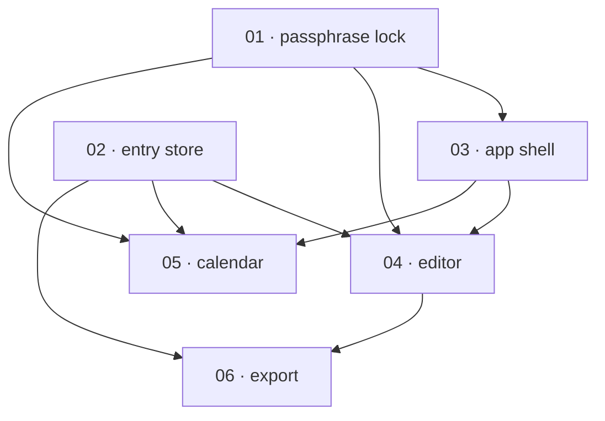

# Task decomposition and ordering

How to slice a specification into task packages, connect them into a dependency graph, and order that graph so the work produces reviewable pieces as early as possible. Read this before Phases 2–3 of the skill.

The output of this method is the input to [`plan-template.md`](plan-template.md): a set of task packages, a dependency table, and an implementation order grouped into milestones — which Phase 4 writes as a `plan.md` at the plan-folder root plus one numbered file per task, each authored into the `backlog/` subfolder of the kanban board.

---

## What a task package is

A **task package** is the unit of a plan: one coherent slice of work that, when merged, leaves the system in a state a reviewer can evaluate on its own.

A good package is:

- **Coherent.** It does one thing. "Add the session store and the login route and the password-reset email" is three packages.
- **Reviewable in one sitting.** Roughly a single focused review — a handful of files, one clear behaviour to exercise. If a reviewer cannot hold it in their head, split it.
- **Independently verifiable.** It has a definition of done that can be checked without waiting for a later package.
- **Vertically sliced where possible.** A thin path that works end to end (one route, its handler, its store access, a test) beats a horizontal layer (every model, with nothing that uses them). Vertical slices are reviewable; horizontal layers defer all review to the end.

During decomposition, give each package a **working label** (a short name). The package becomes a file `NN-snake_case_task.md` — authored into `backlog/` beside its `NN-snake_case_task-certificate.md` — where the two-digit number `NN` is assigned in **implementation order** during Phase 4, after the order is fixed in Phase 3. The file **moves between the kanban subfolders** (`backlog/` → `in-progress/` → `blocked/`/`done/`) as it is built, but `NN` is its **immutable identity** everywhere — the dependency table, the Mermaid graph, every cross-reference, the certificate name — and never changes with the file's location. Numbers are **append-only** once the plan is shared (a later task takes the next free number and records its real position in the order table) — never renumber, or every cross-reference breaks.

### Sizing

| Symptom | Action |
|---|---|
| A package touches three unrelated subsystems | Split — one per subsystem. |
| A package's DoD has more than ~6 acceptance items | Probably two packages wearing one id. |
| A package cannot be reviewed until a later package lands | Re-cut: either merge them or invert the dependency. |
| Two packages are always touched together and never reviewed apart | Merge them. |
| A "package" is a single one-line change | Fold it into the package that needs it. |

---

## Mapping the spec to packages

Walk the spec and assign each piece of described behaviour to a package. Track the mapping both ways — it is what Phase 5 verifies:

- **Forward:** every in-scope spec section is implemented by at least one package.
- **Reverse:** every package names the spec section(s) it implements.

For a **canonical spec set**, the domain model and per-component pages are the richest source of packages: each entity's persistence, each route group, each runtime subsystem tends to be one or a few packages. For a **change spec**, the `Proposed changes` blocks and `Implementation notes` are the seed — expand them into packages, do not just copy the notes. For an **external spec** (PRD, RFC, OpenAPI), map each feature / endpoint / requirement to a package and note that the source has no canonical schema to check against (an Open question if types are ambiguous).

---

## Dependency edges

Draw an edge from `A → B` ("A before B") whenever B depends on A in any of these four ways. The first three are about *buildability*; the fourth is about *reviewability* and is the one ordinary planning misses.

| Edge type | `A → B` means | Example |
|---|---|---|
| **Build** | B's code cannot be written until A exists | The login route (B) needs the session service (A). |
| **Data** | B reads or persists data whose shape A defines | The calendar view (B) reads the entries store (A). |
| **Contract** | B calls an API, port, or interface A defines | The client (B) calls the endpoint contract (A). |
| **Review** | B cannot be *reviewed* end to end until A works | A settings page (B) gated behind auth (A) — without auth, a reviewer cannot reach it. |

Review edges are how the reviewability principle becomes part of the graph. A feature that is technically buildable before auth but cannot be *exercised* without it still gets an edge from auth — because the plan optimizes for reviewable states, not just compilable ones.

**The graph must be a DAG.** A cycle means the slice is wrong: two packages that each depend on the other are really one package, or the boundary between them is in the wrong place. Re-cut until the cycle is gone. Do not "break" a cycle by ignoring an edge.

---

## Ordering for reviewability

A topological sort gives a *valid* order — one that respects every edge. There are usually many valid orders; this step picks the one that surfaces reviewable work earliest.

The method:

1. **Topologically sort** the DAG. This is the floor — any order must respect it.
2. **At each step, among the ready packages** (all dependencies already scheduled), prefer, in this priority:
   1. **Enablers that unlock the most downstream review** — the package with the most outgoing review edges. Auth, the app shell, persistence schema, seed/fixture data, the CI gate. These are reviewed-through by everything after them.
   2. **Packages that produce visible, demonstrable surface** — a working route, a rendered view — over packages that produce only internal plumbing.
   3. **Packages that retire the most risk** — the unknown integration, the load-bearing assumption — so a wrong assumption is caught while little depends on it.
3. **Break ties** by smallest package (faster first review) and by keeping a vertical slice together (finish a demonstrable path before starting the next).

The headline case, stated as a rule: **build the enablers that later features are reviewed through, first.** If an app needs auth and most features sit behind it, auth is an early package even if some back-end work could technically precede it — because every gated feature's review depends on auth working.

---

## Milestones

Group the ordered packages into **milestones**, each ending at a reviewable state. A milestone is a checkpoint where a reviewer can exercise something coherent and sign off before the next batch starts.

For each milestone, name:

- The packages it contains (by id).
- **What is demonstrable** when it completes — the concrete thing a reviewer can do ("a user can sign in and see an empty dashboard").
- Any **review gate** — what must pass before the next milestone begins.

A typical shape: *M1 — foundations* (schema, app shell, auth: the system stands up and a reviewer can sign in); *M2 — core feature* (the primary vertical slice works end to end); *M3 — secondary features and polish* (everything reviewed through M1/M2). The number and names vary with the spec; the rule is constant — every milestone boundary is a reviewable state.

---

## Worked example

Spec: a journal app — entries persisted in IndexedDB, a calendar view to navigate days, a rich-text editor, all behind a single-user passphrase lock. Development guidelines require negative-space tests and a named constant for every limit.

**Decomposition** surfaces six packages (working labels): *passphrase lock* (`06-auth.md`), *entry store* (`01-domain-model.md` §Entry, `04-persistence.md`), *app shell* (`02-app-shell.md`), *editor* (`03-runtime.md` §Editor), *calendar* (`03-runtime.md` §Calendar), *export* (`04-persistence-and-export.md` §Export).

**Edges:** *store → editor / calendar / export* (data — they read entries); *app shell → editor / calendar* (build — the views mount in the shell); *lock → app shell / editor / calendar* (review — everything sits behind the lock, so nothing is reviewable until the lock works); *editor → export* (review — export is easiest to review once there are entries to export).

**Ordering** is where the numbering comes from. A naive dependency-only sort might start with the *entry store* (it has no dependencies). The reviewability bias promotes the *passphrase lock* instead: it is reviewed-through by everything, so building it first means every later package can be exercised end to end. The resulting order, assigned as the task numbers:

| Task | Depends on | Edge kind | Produces |
|---|---|---|---|
| 01 · passphrase lock | — | — | a reviewer can unlock the app |
| 02 · entry store | — | — | entries persist across reloads |
| 03 · app shell | 01 | review | the shell renders behind the lock |
| 04 · editor | 01, 02, 03 | build, data, review | a user can write and save an entry |
| 05 · calendar | 01, 02, 03 | build, data, review | navigate to a day and open its entry |
| 06 · export | 02, 04 | data, review | export the entries just written |

Note that every `Depends on` references a **lower** number — the guarantee you get from numbering in a valid implementation order. The `NN` prefix is the task's identity, not its location: each file is authored into `backlog/` and moves between subfolders as it is built, sorting by `NN` *within* whichever subfolder currently holds it. The folder shows current status; the number shows build sequence.

**Milestones:** *M1 (01, 02, 03)* — a reviewer can unlock the app and see an empty shell backed by a working store. *M2 (04, 05)* — write an entry and navigate to it on the calendar. *M3 (06)* — export the entries created in M2.
